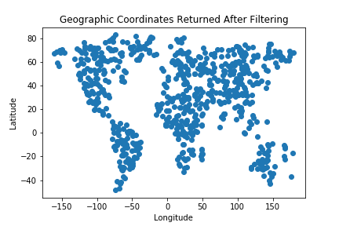
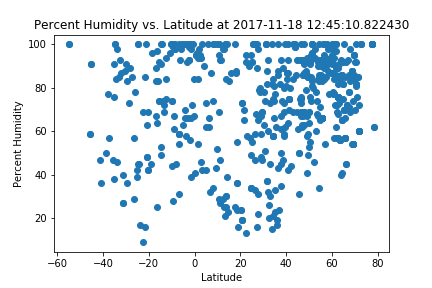
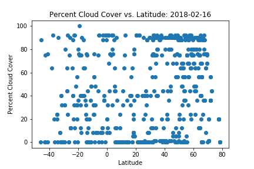
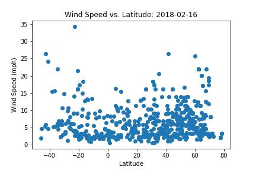
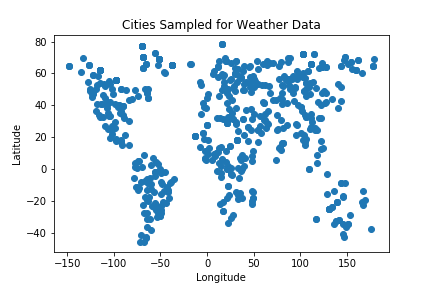

# Weather Data vs Latitude

## Purpose
The purpose of this project was to see how weather changes with latitude. First, a large number of random numbers were generated to form coordinate pairs. All coordinates that did fall on land were discarded using google's timezone api. Next the citipy python library was used to find the nearest city to each randomly generated coordinate pair. The open weather map api was then used to find the current temperature, humidity, cloud cover, and wind speed for each city.

Each of these parameters was plotted against the cities latitude to see how temperature varies with distance from the equator. 2500 random coordinate pairs were used to find over 500 cities to perform this analyses. The data and visualizations from this analysis can be found on this site. Click on any of the images on the right to see more analysis.

## Requirements
This notebook requires python to be installed. Python 3.6.2 was used during development. The pandas library used to store, manipulate, filter, merge and perform calculations with the data. The matplotlib and numpy libraries were used to generate the plots showing the trends of various parameters versus latitude. The citipy library was used to get the coordinate pairs used to call openweathermap api. The requests library was used to make the actual calls to the openweathermap api. The jupyter library was used to execute the python code and display results.
All required libraries can be found in requirements.txt and installed with the following command: <br/>
<br/>
`pip install requirements.txt -r` <br/>
<br/>
You will also need to create a config.py file with variables containing the variables google_key and weather_key containing your api keys for google maps and openweatherapi.

## Running the Code
To run the notebook enter the following into the command line: 
`$ jupyter notebook`
Open up the weather_data_vs_latitude.ipynb notebook in your browser and then click the 'Kernal' and the 'Restart and run all option'

## Results
All of the results can be seen at the following link: https://dmarrinan.github.io/Weather-Data-vs-Latitude/index.html

```python
#import dependencies
import json
import csv
import pandas as pd
import numpy as np
import requests
import os
import matplotlib.pyplot as plt
from config import google_key
from config import weather_key
import time
from citipy import citipy
import datetime
```


```python
lats = np.random.uniform(low=-90.000, high=90.000, size=2500)
lngs = np.random.uniform(low=-180.000, high=180.000, size=2500)
lngs
```


    array([ 176.45664396,  -64.48603189,  -20.620595  , ...,  135.3778374 ,
             96.76409872, -169.74508742])


```python
#loop through coordinates
#perform rough filter to remove most of ocean and antarctic coordinates
#used this map to find regions of ocean/antarctica https://www.colorado.edu/geography/gcraft/notes/coordsys/gif/georef.gif
not_in_tests_coordinate_pairs = []
for i in range(len(lats)):
    antarctic = (lats[i] < -60)
    pacific1 = (lats[i] < 10) and (lngs[i]<-95)
    pacific2 = (lats[i]>0 and lats[i] < 45) and (lngs[i]<-130)
    pacific3 = (lats[i]>0 and lats[i] < 45) and (lngs[i]>150)
    indian = (lats[i] < 5) and (lngs[i]>55 and lngs[i]<95)
    atlantic1 = (lats[i]>10 and lats[i] < 45) and (lngs[i]>-60 and lngs[i]<-20)
    atlantic2 = (lats[i] < 5) and (lngs[i]>-35 and lngs[i]<5)
    if ~antarctic and ~pacific1 and ~pacific1 and ~pacific3 and ~indian and ~atlantic1 and ~atlantic2:
        not_in_tests_coordinate_pairs.append([lats[i], lngs[i]])

#not_in_tests_coordinate_pairs_test = not_in_tests_coordinate_pairs[:5]
len(not_in_tests_coordinate_pairs)
```


    1569


```python
#save data so that you don't have to refilter data
not_in_tests_coordinate_pairs_df = pd.DataFrame(not_in_tests_coordinate_pairs)
not_in_tests_coordinate_pairs_df.to_csv('not_in_tests_coordinate_pairs.csv',index=False)
```


```python
#load filtered data
not_in_tests_coordinate_pairs_df = pd.read_csv('not_in_tests_coordinate_pairs.csv')
not_in_tests_coordinate_pairs = []
for i in range(len(not_in_tests_coordinate_pairs_df)):
    not_in_tests_coordinate_pairs.append([not_in_tests_coordinate_pairs_df.iloc[i,0],not_in_tests_coordinate_pairs_df.iloc[i,1]])
len(not_in_tests_coordinate_pairs)
```


    1569


```python
#use google timezone api to remove ocean coordinates
coordinate_pairs = []
url = 'https://maps.googleapis.com/maps/api/timezone/json?'
for coordinate_pair in not_in_tests_coordinate_pairs:
    params = {'key':google_key,
         'timestamp':time.time(),
         'location':f'{coordinate_pair[0]}, {coordinate_pair[1]}'}
    response = requests.get(url,params=params).json()
    if len(response.keys()) != 1:
        coordinate_pairs.append(coordinate_pair)
len(coordinate_pairs)  
```


    699


```python
#save data so that you don't need to re call google api
coordinate_pairs_df = pd.DataFrame(coordinate_pairs)
coordinate_pairs_df.to_csv('coordinate_pairs_to_test.csv',index=False)
```


```python
#load data so that you don't need to re call google api
coordinate_pairs_df = pd.read_csv('coordinate_pairs_to_test.csv')
coordinate_pairs = []
for i in range(len(coordinate_pairs_df)):
    coordinate_pairs.append([coordinate_pairs_df.iloc[i,0],coordinate_pairs_df.iloc[i,1]])
len(coordinate_pairs)
```


    699


```python
#show distribution of geographic coordinates used to grab weather data
plt.scatter(coordinate_pairs_df.iloc[:,1],coordinate_pairs_df.iloc[:,0])
plt.title("Geographic Coordinates Returned After Filtering")
plt.xlabel("Longitude")
plt.ylabel("Latitude")
plt.savefig("coordinates_after_filter.png")
plt.show()
```





```python
results_columns = ['City','Latitude','Longitude','Temperature','Humidity','Cloudiness','Wind Speed']
results_index = list(range(len(city_list)))
results = pd.DataFrame(columns=results_columns,index=results_index)
url = 'http://api.openweathermap.org/data/2.5/weather?'
count = 0
for index,city in enumerate(city_list):
    params = {'units':'imperial',"appid":weather_key,'q':f'{city[0]},{city[1]}'}
    response = requests.get(url,params).json()
    print(f'Processing coordinate pair: {index} for city: {city[0]},{city[1]}')
    if len(response.keys()) != 2:    
        count = count + 1
        lat = response['coord']['lat']
        lng = response['coord']['lon']
        temp_max = response['main']['temp_max']
        humidity = response['main']['humidity']
        wind_speed = response['wind']['speed']
        cloud_cover = response['clouds']['all']
        results_row = {'City':city[0],
                       'Latitude':lat,
                       'Longitude':lng,
                       'Temperature':temp_max,
                       'Humidity':humidity,
                       'Cloudiness':cloud_cover,
                       'Wind Speed':wind_speed}
        results.iloc[count] = results_row
```

<div>
<table border="1" class="dataframe">
  <thead>
    <tr style="text-align: right;">
      <th></th>
      <th>City</th>
      <th>Latitude</th>
      <th>Longitude</th>
      <th>Temperature</th>
      <th>Humidity</th>
      <th>Cloudiness</th>
      <th>Wind Speed</th>
    </tr>
  </thead>
  <tbody>
    <tr>
      <th>0</th>
      <td>NaN</td>
      <td>NaN</td>
      <td>NaN</td>
      <td>NaN</td>
      <td>NaN</td>
      <td>NaN</td>
      <td>NaN</td>
    </tr>
    <tr>
      <th>1</th>
      <td>villa carlos paz</td>
      <td>-31.42</td>
      <td>-64.5</td>
      <td>71.6</td>
      <td>73</td>
      <td>0</td>
      <td>5.82</td>
    </tr>
    <tr>
      <th>2</th>
      <td>tasiilaq</td>
      <td>65.61</td>
      <td>-37.64</td>
      <td>28.4</td>
      <td>74</td>
      <td>0</td>
      <td>4.7</td>
    </tr>
    <tr>
      <th>3</th>
      <td>myingyan</td>
      <td>21.46</td>
      <td>95.39</td>
      <td>75.2</td>
      <td>53</td>
      <td>40</td>
      <td>5.82</td>
    </tr>
    <tr>
      <th>4</th>
      <td>bibiani</td>
      <td>6.45</td>
      <td>-2.31</td>
      <td>77.53</td>
      <td>80</td>
      <td>12</td>
      <td>10.16</td>
    </tr>
    <tr>
      <th>5</th>
      <td>tumkur</td>
      <td>13.34</td>
      <td>77.1</td>
      <td>68</td>
      <td>88</td>
      <td>0</td>
      <td>2.24</td>
    </tr>
    <tr>
      <th>6</th>
      <td>fortuna foothills</td>
      <td>32.66</td>
      <td>-114.41</td>
      <td>64.4</td>
      <td>22</td>
      <td>1</td>
      <td>5.82</td>
    </tr>
    <tr>
      <th>7</th>
      <td>san sebastian huehuetenango</td>
      <td>15.39</td>
      <td>-91.62</td>
      <td>51.84</td>
      <td>69</td>
      <td>0</td>
      <td>1.61</td>
    </tr>
    <tr>
      <th>8</th>
      <td>khatanga</td>
      <td>71.98</td>
      <td>102.47</td>
      <td>-15.26</td>
      <td>46</td>
      <td>36</td>
      <td>2.89</td>
    </tr>
    <tr>
      <th>9</th>
      <td>vinh</td>
      <td>18.67</td>
      <td>105.69</td>
      <td>69.57</td>
      <td>99</td>
      <td>80</td>
      <td>4.41</td>
    </tr>
    <tr>
      <th>10</th>
      <td>northam</td>
      <td>-31.65</td>
      <td>116.67</td>
      <td>78.8</td>
      <td>54</td>
      <td>40</td>
      <td>6.93</td>
    </tr>
    <tr>
      <th>11</th>
      <td>hovd</td>
      <td>48.01</td>
      <td>91.64</td>
      <td>5.04</td>
      <td>51</td>
      <td>12</td>
      <td>5.75</td>
    </tr>
    <tr>
      <th>12</th>
      <td>baykit</td>
      <td>61.68</td>
      <td>96.39</td>
      <td>-9.46</td>
      <td>65</td>
      <td>48</td>
      <td>5.08</td>
    </tr>
    <tr>
      <th>13</th>
      <td>xihe</td>
      <td>34.02</td>
      <td>105.29</td>
      <td>27.94</td>
      <td>82</td>
      <td>68</td>
      <td>8.32</td>
    </tr>
    <tr>
      <th>14</th>
      <td>whitehorse</td>
      <td>60.72</td>
      <td>-135.06</td>
      <td>15.8</td>
      <td>72</td>
      <td>90</td>
      <td>11.41</td>
    </tr>
    <tr>
      <th>15</th>
      <td>khatanga</td>
      <td>71.98</td>
      <td>102.47</td>
      <td>-15.26</td>
      <td>46</td>
      <td>36</td>
      <td>2.89</td>
    </tr>
    <tr>
      <th>16</th>
      <td>la peca</td>
      <td>-5.61</td>
      <td>-78.44</td>
      <td>65.83</td>
      <td>100</td>
      <td>92</td>
      <td>1.77</td>
    </tr>
    <tr>
      <th>17</th>
      <td>ust-ilimsk</td>
      <td>57.96</td>
      <td>102.73</td>
      <td>0.72</td>
      <td>72</td>
      <td>64</td>
      <td>5.53</td>
    </tr>
    <tr>
      <th>18</th>
      <td>shelburne</td>
      <td>44.08</td>
      <td>-80.2</td>
      <td>19.4</td>
      <td>100</td>
      <td>1</td>
      <td>6.64</td>
    </tr>
    <tr>
      <th>19</th>
      <td>xining</td>
      <td>36.62</td>
      <td>101.77</td>
      <td>26.82</td>
      <td>67</td>
      <td>88</td>
      <td>3.85</td>
    </tr>
    <tr>
      <th>20</th>
      <td>qasigiannguit</td>
      <td>68.82</td>
      <td>-51.19</td>
      <td>-0.41</td>
      <td>77</td>
      <td>76</td>
      <td>3.36</td>
    </tr>
    <tr>
      <th>21</th>
      <td>tenali</td>
      <td>16.24</td>
      <td>80.65</td>
      <td>75.2</td>
      <td>78</td>
      <td>40</td>
      <td>4.56</td>
    </tr>
    <tr>
      <th>22</th>
      <td>vanavara</td>
      <td>60.35</td>
      <td>102.28</td>
      <td>-6.85</td>
      <td>73</td>
      <td>48</td>
      <td>4.85</td>
    </tr>
    <tr>
      <th>23</th>
      <td>kampene</td>
      <td>-3.59</td>
      <td>26.67</td>
      <td>70.02</td>
      <td>98</td>
      <td>0</td>
      <td>2.06</td>
    </tr>
    <tr>
      <th>24</th>
      <td>clyde river</td>
      <td>70.47</td>
      <td>-68.59</td>
      <td>-34.61</td>
      <td>59</td>
      <td>1</td>
      <td>8.05</td>
    </tr>
    <tr>
      <th>25</th>
      <td>kiruna</td>
      <td>67.86</td>
      <td>20.23</td>
      <td>-4.01</td>
      <td>83</td>
      <td>36</td>
      <td>3.36</td>
    </tr>
    <tr>
      <th>26</th>
      <td>kutum</td>
      <td>14.2</td>
      <td>24.66</td>
      <td>60.66</td>
      <td>55</td>
      <td>0</td>
      <td>9.6</td>
    </tr>
    <tr>
      <th>27</th>
      <td>tyukhtet</td>
      <td>56.54</td>
      <td>89.31</td>
      <td>3.19</td>
      <td>74</td>
      <td>88</td>
      <td>10.11</td>
    </tr>
    <tr>
      <th>28</th>
      <td>sapele</td>
      <td>5.89</td>
      <td>5.68</td>
      <td>78.79</td>
      <td>90</td>
      <td>0</td>
      <td>5.91</td>
    </tr>
    <tr>
      <th>29</th>
      <td>novichikha</td>
      <td>52.2</td>
      <td>81.39</td>
      <td>4.09</td>
      <td>81</td>
      <td>64</td>
      <td>5.75</td>
    </tr>
    <tr>
      <th>...</th>
      <td>...</td>
      <td>...</td>
      <td>...</td>
      <td>...</td>
      <td>...</td>
      <td>...</td>
      <td>...</td>
    </tr>

  </tbody>
</table>
</div>


```python
date_time_now = datetime.datetime.now()
date_time_now = date_time_now.strftime("%Y-%m-%d")
print(f'Analysis performed: {date_time_now}')
```

    Analysis performed: 2018-02-16
    


```python
results = results.dropna()
results.to_csv('results.csv',index=False)
len(results)
```


    615


```python
#load results so that you don't need to re call openweather api
results = pd.read_csv('results.csv')
len(results)
```


    615


```python
#plot Humidity vs. Latitude
plt.scatter(results["Latitude"],results["Humidity"])
plt.xlabel("Latitude")
plt.ylabel("Percent Humidity")
plt.title(f"Percent Humidity vs. Latitude: {date_time_now}")
plt.savefig("humidity_vs_latitude.png")
plt.show()
```





```python
#plot Temperature vs. Latitude
plt.scatter(results["Latitude"],results["Temperature"])
plt.xlabel("Latitude")
plt.ylabel("Temperature (Degrees Farenheit)")
plt.title(f"Temperature vs. Latitude: {date_time_now}")
plt.savefig("temperature_vs_latitude.png")
plt.show()
```


```python
#plot Cloud Cover vs. Latitude
plt.scatter(results["Latitude"],results["Cloudiness"])
plt.xlabel("Latitude")
plt.ylabel("Percent Cloud Cover")
plt.title(f"Percent Cloud Cover vs. Latitude: {date_time_now}")
plt.savefig("cloud_cover_vs_latitude.png")
plt.show()
```





```python
#plot Wind Speed vs. Latitude
plt.scatter(results["Latitude"],results["Wind Speed"])
plt.xlabel("Latitude")
plt.ylabel("Wind Speed (mph)")
plt.title(f"Wind Speed vs. Latitude: {date_time_now}")
plt.savefig("wind_speed_vs_latitude.png")
plt.show()
```





```python
#plot geographic coordinates of cities returned by citipy
plt.scatter(results["Longitude"],results["Latitude"])
plt.title("Cities Sampled for Weather Data")
plt.xlabel("Longitude")
plt.ylabel("Latitude")
plt.savefig("cities_sampled.png")
plt.show()
```





## Observable Trends

1) Temperature seems to vary linearly with latitude. The slope seems to be steeper for the northern hemisphere. This most likely occurred because this analysis was done in Novemeber when it would be winter for the northern hemisphere and summer for the southern hemisphere. It would be interesting to do this analysis with averages for the whole year to see if this trend was still seen.

One can also see from this plot that there are more cities closer to the poles in the southern hemisphere to get data from because of the difference in land area near the north pole vs the south pole.

2) Humidity seems to be very weakly coorelated with latitude as there are two relative minimums around 20 degrees away from the equator. It is interesting that there is an inflection point around the equator. There is not a strong enough correlation to tell if this is a true trend or just an artifact of the random coordinate chosen. More analysis would need to be done to explore this relationship further.

3) The percent cloud cover appears to be complete random with respect to latitude. This means that most likely cloud cover most likely is not significantly correlated with temperature.

4) In general wind speed seems to be fairly random with respect to latitude, although it does appear that the largest outliers occur near the poles. More data would be needed to make further conclusions about this relationship.

