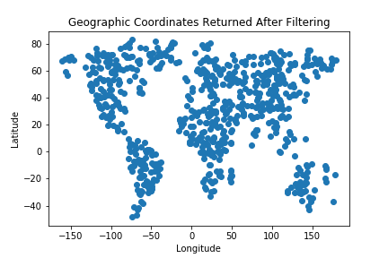
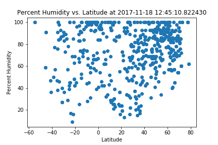
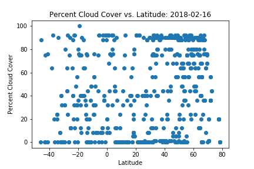
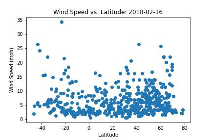
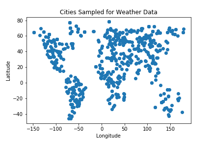

The purpose of this project was to see how weather changes with latitude. First, a large number of random numbers were generated to form coordinate pairs. All coordinates that did fall on land were discarded using google's timezone api. Next the citipy python library was used to find the nearest city to each randomly generated coordinate pair. The open weather map api was then used to find the current temperature, humidity, cloud cover, and wind speed for each city.

Each of these parameters was plotted against the cities latitude to see how temperature varies with distance from the equator. 2500 random coordinate pairs were used to find over 500 cities to perform this analyses. The data and visualizations from this analysis can be found on this site. Click on any of the images on the right to see more analysis.

```python
#import dependencies
import json
import csv
import pandas as pd
import numpy as np
import requests
import os
import matplotlib.pyplot as plt
from config import google_key
from config import weather_key
import time
from citipy import citipy
import datetime
```


```python
lats = np.random.uniform(low=-90.000, high=90.000, size=2500)
lngs = np.random.uniform(low=-180.000, high=180.000, size=2500)
lngs
```


    array([ 176.45664396,  -64.48603189,  -20.620595  , ...,  135.3778374 ,
             96.76409872, -169.74508742])


```python
#loop through coordinates
#perform rough filter to remove most of ocean and antarctic coordinates
#used this map to find regions of ocean/antarctica https://www.colorado.edu/geography/gcraft/notes/coordsys/gif/georef.gif
not_in_tests_coordinate_pairs = []
for i in range(len(lats)):
    antarctic = (lats[i] < -60)
    pacific1 = (lats[i] < 10) and (lngs[i]<-95)
    pacific2 = (lats[i]>0 and lats[i] < 45) and (lngs[i]<-130)
    pacific3 = (lats[i]>0 and lats[i] < 45) and (lngs[i]>150)
    indian = (lats[i] < 5) and (lngs[i]>55 and lngs[i]<95)
    atlantic1 = (lats[i]>10 and lats[i] < 45) and (lngs[i]>-60 and lngs[i]<-20)
    atlantic2 = (lats[i] < 5) and (lngs[i]>-35 and lngs[i]<5)
    if ~antarctic and ~pacific1 and ~pacific1 and ~pacific3 and ~indian and ~atlantic1 and ~atlantic2:
        not_in_tests_coordinate_pairs.append([lats[i], lngs[i]])

#not_in_tests_coordinate_pairs_test = not_in_tests_coordinate_pairs[:5]
len(not_in_tests_coordinate_pairs)
```


    1569


```python
#save data so that you don't have to refilter data
not_in_tests_coordinate_pairs_df = pd.DataFrame(not_in_tests_coordinate_pairs)
not_in_tests_coordinate_pairs_df.to_csv('not_in_tests_coordinate_pairs.csv',index=False)
```


```python
#load filtered data
not_in_tests_coordinate_pairs_df = pd.read_csv('not_in_tests_coordinate_pairs.csv')
not_in_tests_coordinate_pairs = []
for i in range(len(not_in_tests_coordinate_pairs_df)):
    not_in_tests_coordinate_pairs.append([not_in_tests_coordinate_pairs_df.iloc[i,0],not_in_tests_coordinate_pairs_df.iloc[i,1]])
len(not_in_tests_coordinate_pairs)
```


    1569


```python
#use google timezone api to remove ocean coordinates
coordinate_pairs = []
url = 'https://maps.googleapis.com/maps/api/timezone/json?'
for coordinate_pair in not_in_tests_coordinate_pairs:
    params = {'key':google_key,
         'timestamp':time.time(),
         'location':f'{coordinate_pair[0]}, {coordinate_pair[1]}'}
    response = requests.get(url,params=params).json()
    if len(response.keys()) != 1:
        coordinate_pairs.append(coordinate_pair)
len(coordinate_pairs)  
```


    699


```python
#save data so that you don't need to re call google api
coordinate_pairs_df = pd.DataFrame(coordinate_pairs)
coordinate_pairs_df.to_csv('coordinate_pairs_to_test.csv',index=False)
```


```python
#load data so that you don't need to re call google api
coordinate_pairs_df = pd.read_csv('coordinate_pairs_to_test.csv')
coordinate_pairs = []
for i in range(len(coordinate_pairs_df)):
    coordinate_pairs.append([coordinate_pairs_df.iloc[i,0],coordinate_pairs_df.iloc[i,1]])
len(coordinate_pairs)
```


    699


```python
#show distribution of geographic coordinates used to grab weather data
plt.scatter(coordinate_pairs_df.iloc[:,1],coordinate_pairs_df.iloc[:,0])
plt.title("Geographic Coordinates Returned After Filtering")
plt.xlabel("Longitude")
plt.ylabel("Latitude")
plt.savefig("coordinates_after_filter.png")
plt.show()
```





```python
city_list = []
for coordinate_pair in coordinate_pairs:
    city = citipy.nearest_city(coordinate_pair[0],coordinate_pair[1])
    city_list.append([city.city_name,city.country_code])

len(city_list)
```


    699


```python
city_list
```


    [['villa carlos paz', 'ar'],
     ['tasiilaq', 'gl'],
     ['attawapiskat', 'ca'],
     ['myingyan', 'mm'],
     ['bibiani', 'gh'],
     ['tumkur', 'in'],
     ['fortuna foothills', 'us'],
     ['san sebastian huehuetenango', 'gt'],
     ['khatanga', 'ru'],
     ['vinh', 'vn'],
     ['northam', 'au'],
     ['hovd', 'mn'],
     ['baykit', 'ru'],
     ['xihe', 'cn'],
     ['whitehorse', 'ca'],
     ['khatanga', 'ru'],
     ['la peca', 'pe'],
     ['ust-ilimsk', 'ru'],
     ['shelburne', 'ca'],
     ['xining', 'cn'],
     ['qasigiannguit', 'gl'],
     ['tenali', 'in'],
     ['uniao da victoria', 'br'],
     ['vanavara', 'ru'],
     ['kampene', 'cd'],
     ['clyde river', 'ca'],
     ['kiruna', 'se'],
     ['kutum', 'sd'],
     ['tyukhtet', 'ru'],
     ['sapele', 'ng'],
     ['novichikha', 'ru'],
     ['longyearbyen', 'sj'],
     ['qaanaaq', 'gl'],
     ['san ramon', 'bo'],
     ['riyadh', 'sa'],
     ['zabol', 'ir'],
     ['stamsund', 'no'],
     ['senno', 'by'],
     ['voyvozh', 'ru'],
     ['nizwa', 'om'],
     ['sanmenxia', 'cn'],
     ['meridian', 'us'],
     ['vista hermosa', 'mx'],
     ['tasiilaq', 'gl'],
     ['isangel', 'vu'],
     ['khatanga', 'ru'],
     ['amboise', 'fr'],
     ['gorey', 'ie'],
     ['say', 'ne'],
     ['lumby', 'ca'],
     ['norman wells', 'ca'],
     ['gulmarg', 'in'],
     ['awjilah', 'ly'],
     ['nanortalik', 'gl'],
     ['marawi', 'sd'],
     ['dubenskiy', 'ru'],
     ['marawi', 'sd'],
     ['loreto', 'mx'],
     ['dasoguz', 'tm'],
     ['chimoio', 'mz'],
     ['magdiwang', 'ph'],
     ['tasiilaq', 'gl'],
     ['talaya', 'ru'],
     ['west plains', 'us'],
     ['horodnytsya', 'ua'],
     ['khatanga', 'ru'],
     ['bozoum', 'cf'],
     ['asayita', 'et'],
     ['vilhena', 'br'],
     ['mocajuba', 'br'],
     ['nogliki', 'ru'],
     ['kharan', 'pk'],
     ['thompson', 'ca'],
     ['iqaluit', 'ca'],
     ['porosozero', 'ru'],
     ['nagai', 'jp'],
     ['palaikastron', 'gr'],
     ['calabozo', 've'],
     ['campbell river', 'ca'],
     ['dalbandin', 'pk'],
     ['naifaru', 'mv'],
     ['bulgan', 'mn'],
     ['yellowknife', 'ca'],
     ['qaanaaq', 'gl'],
     ['upernavik', 'gl'],
     ['san pedro', 'bo'],
     ['kirgiz-miyaki', 'ru'],
     ['curaca', 'br'],
     ['komsomolskiy', 'ru'],
     ['tazovskiy', 'ru'],
     ['smithers', 'ca'],
     ['longyearbyen', 'sj'],
     ['matagami', 'ca'],
     ['bom jesus', 'br'],
     ['haibowan', 'cn'],
     ['santiago del estero', 'ar'],
     ['toamasina', 'mg'],
     ['illoqqortoormiut', 'gl'],
     ['casino', 'au'],
     ['pipar', 'in'],
     ['akim swedru', 'gh'],
     ['faya', 'td'],
     ['narok', 'ke'],
     ['norman wells', 'ca'],
     ['aykhal', 'ru'],
     ['geraldton', 'ca'],
     ['awjilah', 'ly'],
     ['san carlos de bariloche', 'ar'],
     ['kidal', 'ml'],
     ['tasiilaq', 'gl'],
     ['oudtshoorn', 'za'],
     ['manasa', 'in'],
     ['conceicao do araguaia', 'br'],
     ['abu dhabi', 'ae'],
     ['jiangyin', 'cn'],
     ['ust-nera', 'ru'],
     ['tsienyane', 'bw'],
     ['khonuu', 'ru'],
     ['bethanien', 'na'],
     ['evensk', 'ru'],
     ['ngukurr', 'au'],
     ['thompson', 'ca'],
     ['kysyl-syr', 'ru'],
     ['nusaybin', 'tr'],
     ['upernavik', 'gl'],
     ['ituporanga', 'br'],
     ['leningradskiy', 'ru'],
     ['ambanja', 'mg'],
     ['northam', 'au'],
     ['tafresh', 'ir'],
     ['jalu', 'ly'],
     ['ginda', 'er'],
     ['boguchany', 'ru'],
     ['clyde river', 'ca'],
     ['tromso', 'no'],
     ['santa rosa', 'ar'],
     ['cumaribo', 'co'],
     ['kysyl-syr', 'ru'],
     ['kodiak', 'us'],
     ['trelew', 'ar'],
     ['illoqqortoormiut', 'gl'],
     ['mago', 'ru'],
     ['sola', 'vu'],
     ['itaituba', 'br'],
     ['mazyr', 'by'],
     ['teglas', 'hu'],
     ['yellowknife', 'ca'],
     ['brumado', 'br'],
     ['fairbanks', 'us'],
     ['baltasi', 'ru'],
     ['tilichiki', 'ru'],
     ['raga', 'sd'],
     ['nueva germania', 'py'],
     ['erdaojiang', 'cn'],
     ['oxelosund', 'se'],
     ['eloy', 'us'],
     ['wollongong', 'au'],
     ['chuguyevka', 'ru'],
     ['igarka', 'ru'],
     ['kizilskoye', 'ru'],
     ['saint-augustin', 'ca'],
     ['pangnirtung', 'ca'],
     ['kantunilkin', 'mx'],
     ['tooele', 'us'],
     ['serra talhada', 'br'],
     ['bardiyah', 'ly'],
     ['raga', 'sd'],
     ['kallithea', 'gr'],
     ['cururupu', 'br'],
     ['marawi', 'sd'],
     ['jihlava', 'cz'],
     ['flinders', 'au'],
     ['charagua', 'bo'],
     ['yellowknife', 'ca'],
     ['yellowknife', 'ca'],
     ['khovu-aksy', 'ru'],
     ['plavinas', 'lv'],
     ['illoqqortoormiut', 'gl'],
     ['marsa matruh', 'eg'],
     ['yaan', 'cn'],
     ['boende', 'cd'],
     ['toamasina', 'mg'],
     ['raga', 'sd'],
     ['gornyak', 'ru'],
     ['port lincoln', 'au'],
     ['yellowknife', 'ca'],
     ['bagdarin', 'ru'],
     ['ballybofey', 'ie'],
     ['simao', 'cn'],
     ['burnie', 'au'],
     ['sembe', 'cg'],
     ['otjiwarongo', 'na'],
     ['buraydah', 'sa'],
     ['yellowknife', 'ca'],
     ['canela', 'br'],
     ['tezu', 'in'],
     ['cassia', 'br'],
     ['torit', 'sd'],
     ['turayf', 'sa'],
     ['barra', 'br'],
     ['aripuana', 'br'],
     ['calama', 'cl'],
     ['sao francisco de paula', 'br'],
     ['zhigansk', 'ru'],
     ['barashevo', 'ru'],
     ['helong', 'cn'],
     ['ipixuna', 'br'],
     ['qaanaaq', 'gl'],
     ['iskateley', 'ru'],
     ['tasiilaq', 'gl'],
     ['ilulissat', 'gl'],
     ['mandalgovi', 'mn'],
     ['attawapiskat', 'ca'],
     ['dongsheng', 'cn'],
     ['banamba', 'ml'],
     ['barrow', 'us'],
     ['zyryanskoye', 'ru'],
     ['thompson', 'ca'],
     ['togur', 'ru'],
     ['kiruna', 'se'],
     ['ilulissat', 'gl'],
     ['son la', 'vn'],
     ['hobyo', 'so'],
     ['teyateyaneng', 'ls'],
     ['borlange', 'se'],
     ['thompson', 'ca'],
     ['grand-santi', 'gf'],
     ['mount isa', 'au'],
     ['senanga', 'zm'],
     ['barrow', 'us'],
     ['pauini', 'br'],
     ['yulara', 'au'],
     ['ayagoz', 'kz'],
     ['luau', 'ao'],
     ['auka', 'hn'],
     ['talnakh', 'ru'],
     ['oriximina', 'br'],
     ['narsaq', 'gl'],
     ['thompson', 'ca'],
     ['sorland', 'no'],
     ['naranjal', 'py'],
     ['babanusah', 'sd'],
     ['shu', 'kz'],
     ['abu dhabi', 'ae'],
     ['porto velho', 'br'],
     ['tigre', 'pa'],
     ['kununurra', 'au'],
     ['waihi beach', 'nz'],
     ['orativ', 'ua'],
     ['surt', 'ly'],
     ['joshimath', 'in'],
     ['mergui', 'mm'],
     ['alyangula', 'au'],
     ['alice springs', 'au'],
     ['aksehir', 'tr'],
     ['kamskiye polyany', 'ru'],
     ['port augusta', 'au'],
     ['mucurici', 'br'],
     ['kachug', 'ru'],
     ['kovdor', 'ru'],
     ['guder', 'et'],
     ['djambala', 'cg'],
     ['evensk', 'ru'],
     ['thompson', 'ca'],
     ['saskylakh', 'ru'],
     ['thompson', 'ca'],
     ['yanchukan', 'ru'],
     ['tapaua', 'br'],
     ['ocampo', 'mx'],
     ['zaranj', 'af'],
     ['bellevue', 'us'],
     ['konin', 'pl'],
     ['kearney', 'us'],
     ['blagoveshchenka', 'ru'],
     ['pontianak', 'id'],
     ['clyde river', 'ca'],
     ['atherton', 'au'],
     ['lake city', 'us'],
     ['kiruna', 'se'],
     ['rameshki', 'ru'],
     ['sosnovo', 'ru'],
     ['mbanza-ngungu', 'cd'],
     ['sangar', 'ru'],
     ['kireka', 'ug'],
     ['piraquara', 'br'],
     ['karpogory', 'ru'],
     ['jasper', 'ca'],
     ['mitu', 'co'],
     ['machilipatnam', 'in'],
     ['salalah', 'om'],
     ['georgetown', 'gy'],
     ['verkhnevilyuysk', 'ru'],
     ['shakawe', 'bw'],
     ['tomelloso', 'es'],
     ['diffa', 'ne'],
     ['macultepec', 'mx'],
     ['daru', 'pg'],
     ['dalvik', 'is'],
     ['kadiri', 'in'],
     ['taoudenni', 'ml'],
     ['evensk', 'ru'],
     ['kaa-khem', 'ru'],
     ['ayan', 'ru'],
     ['perry', 'us'],
     ['porto velho', 'br'],
     ['jardim', 'br'],
     ['puerto madryn', 'ar'],
     ['sembakung', 'id'],
     ['zhangzhou', 'cn'],
     ['fort nelson', 'ca'],
     ['anadyr', 'ru'],
     ['forest grove', 'us'],
     ['det udom', 'th'],
     ['helena', 'us'],
     ['pangoa', 'pe'],
     ['zhangye', 'cn'],
     ['russellville', 'us'],
     ['catamarca', 'ar'],
     ['yar-sale', 'ru'],
     ['gucheng', 'cn'],
     ['lasa', 'cn'],
     ['hazorasp', 'uz'],
     ['ilulissat', 'gl'],
     ['longyearbyen', 'sj'],
     ['matay', 'eg'],
     ['itahari', 'np'],
     ['clyde river', 'ca'],
     ['caraquet', 'ca'],
     ['turayf', 'sa'],
     ['maksatikha', 'ru'],
     ['jalu', 'ly'],
     ['barentsburg', 'sj'],
     ['boa vista', 'br'],
     ['kalanguy', 'ru'],
     ['cherskiy', 'ru'],
     ['aykhal', 'ru'],
     ['aykhal', 'ru'],
     ['bassar', 'tg'],
     ['mizan teferi', 'et'],
     ['nynashamn', 'se'],
     ['muzhi', 'ru'],
     ['anadyr', 'ru'],
     ['gangotri', 'in'],
     ['bolungarvik', 'is'],
     ['avare', 'br'],
     ['afua', 'br'],
     ['lebork', 'pl'],
     ['lisakovsk', 'kz'],
     ['lata', 'sb'],
     ['guilin', 'cn'],
     ['pangnirtung', 'ca'],
     ['sao sepe', 'br'],
     ['port augusta', 'au'],
     ['thompson', 'ca'],
     ['halifax', 'ca'],
     ['alamos', 'mx'],
     ['mbacke', 'sn'],
     ['kushmurun', 'kz'],
     ['ust-ilimsk', 'ru'],
     ['abiy adi', 'et'],
     ['high level', 'ca'],
     ['yulara', 'au'],
     ['that phanom', 'th'],
     ['krasnoarmeyskoye', 'ru'],
     ['fort nelson', 'ca'],
     ['mount isa', 'au'],
     ['kisangani', 'cd'],
     ['satipo', 'pe'],
     ['marolambo', 'mg'],
     ['kurumkan', 'ru'],
     ['lengshuitan', 'cn'],
     ['dukat', 'ru'],
     ['cooma', 'au'],
     ['clyde river', 'ca'],
     ['cody', 'us'],
     ['husavik', 'is'],
     ['novochernorechenskiy', 'ru'],
     ['jabiru', 'au'],
     ['jinka', 'et'],
     ['kobojango', 'bw'],
     ['kostino', 'ru'],
     ['lephepe', 'bw'],
     ['qaanaaq', 'gl'],
     ['amahai', 'id'],
     ['comodoro rivadavia', 'ar'],
     ['yellowknife', 'ca'],
     ['sura', 'ru'],
     ['concepcion del oro', 'mx'],
     ['zhezkazgan', 'kz'],
     ['suleja', 'ng'],
     ['mao', 'td'],
     ['kindu', 'cd'],
     ['buraydah', 'sa'],
     ['griffith', 'au'],
     ['broken hill', 'au'],
     ['laguna de duero', 'es'],
     ['yulara', 'au'],
     ['hondo', 'us'],
     ['college', 'us'],
     ['taoudenni', 'ml'],
     ['illoqqortoormiut', 'gl'],
     ['aban', 'ru'],
     ['qaanaaq', 'gl'],
     ['vastervik', 'se'],
     ['abu dhabi', 'ae'],
     ['chokurdakh', 'ru'],
     ['illoqqortoormiut', 'gl'],
     ['khatanga', 'ru'],
     ['yellowknife', 'ca'],
     ['bauchi', 'ng'],
     ['rio rancho', 'us'],
     ['najran', 'sa'],
     ['barrhead', 'ca'],
     ['coihaique', 'cl'],
     ['barguzin', 'ru'],
     ['airai', 'pw'],
     ['ginir', 'et'],
     ['college', 'us'],
     ['yerbogachen', 'ru'],
     ['miraflores', 'co'],
     ['jiaocheng', 'cn'],
     ['gorno-chuyskiy', 'ru'],
     ['tabory', 'ru'],
     ['tabas', 'ir'],
     ['guangyuan', 'cn'],
     ['sapouy', 'bf'],
     ['etne', 'no'],
     ['tasiilaq', 'gl'],
     ['kamenskoye', 'ru'],
     ['khonuu', 'ru'],
     ['kapoeta', 'sd'],
     ['mareeba', 'au'],
     ['wajir', 'ke'],
     ['faya', 'td'],
     ['srednekolymsk', 'ru'],
     ['rawah', 'iq'],
     ['rorvik', 'no'],
     ['aksu', 'cn'],
     ['kyshtovka', 'ru'],
     ['nizhniy baskunchak', 'ru'],
     ['verkhnyaya inta', 'ru'],
     ['gat', 'ly'],
     ['marawi', 'sd'],
     ['graham', 'us'],
     ['purpe', 'ru'],
     ['tuktoyaktuk', 'ca'],
     ['artyk', 'ru'],
     ['orange cove', 'us'],
     ['moron', 'mn'],
     ['saginaw', 'us'],
     ['ilulissat', 'gl'],
     ['bosaso', 'so'],
     ['cherskiy', 'ru'],
     ['barbar', 'sd'],
     ['kenitra', 'ma'],
     ['am timan', 'td'],
     ['illoqqortoormiut', 'gl'],
     ['luau', 'ao'],
     ['lebyazhye', 'ru'],
     ['longyearbyen', 'sj'],
     ['miracema do tocantins', 'br'],
     ['illoqqortoormiut', 'gl'],
     ['darnah', 'ly'],
     ['gazojak', 'tm'],
     ['abong mbang', 'cm'],
     ['havre-saint-pierre', 'ca'],
     ['thompson', 'ca'],
     ['yeniseysk', 'ru'],
     ['atar', 'mr'],
     ['roswell', 'us'],
     ['aykhal', 'ru'],
     ['port-cartier', 'ca'],
     ['karatau', 'kz'],
     ['esil', 'kz'],
     ['la oroya', 'pe'],
     ['bethanien', 'na'],
     ['gat', 'ly'],
     ['thompson', 'ca'],
     ['madinat sittah uktubar', 'eg'],
     ['atar', 'mr'],
     ['yanan', 'cn'],
     ['ambodifototra', 'mg'],
     ['tetelzingo', 'mx'],
     ['obihiro', 'jp'],
     ['japura', 'br'],
     ['belaya gora', 'ru'],
     ['oriximina', 'br'],
     ['zyryanka', 'ru'],
     ['qaanaaq', 'gl'],
     ['alice springs', 'au'],
     ['bani walid', 'ly'],
     ['torit', 'sd'],
     ['bosobolo', 'cd'],
     ['biu', 'ng'],
     ['lloydminster', 'ca'],
     ['barrow', 'us'],
     ['lieksa', 'fi'],
     ['norman wells', 'ca'],
     ['araouane', 'ml'],
     ['colesberg', 'za'],
     ['tasiilaq', 'gl'],
     ['machinga', 'mw'],
     ['santa catarina de tepehuanes', 'mx'],
     ['koping', 'se'],
     ['khatanga', 'ru'],
     ['zalantun', 'cn'],
     ['susangerd', 'ir'],
     ['lata', 'sb'],
     ['union', 'ph'],
     ['along', 'in'],
     ['novo selo', 'mk'],
     ['henties bay', 'na'],
     ['mecca', 'sa'],
     ['fougamou', 'ga'],
     ['itigi', 'tz'],
     ['aykhal', 'ru'],
     ['rafaela', 'ar'],
     ['kargopol', 'ru'],
     ['zharkent', 'kz'],
     ['yumen', 'cn'],
     ['qidong', 'cn'],
     ['caraquet', 'ca'],
     ['sangar', 'ru'],
     ['dudinka', 'ru'],
     ['sobolevo', 'ru'],
     ['bocaranga', 'cf'],
     ['adrar', 'dz'],
     ['thompson', 'ca'],
     ['bealanana', 'mg'],
     ['aykhal', 'ru'],
     ['hailun', 'cn'],
     ['yellowknife', 'ca'],
     ['west wendover', 'us'],
     ['ovre ardal', 'no'],
     ['zhangye', 'cn'],
     ['tasiilaq', 'gl'],
     ['labrea', 'br'],
     ['lasa', 'cn'],
     ['marsa matruh', 'eg'],
     ['unity', 'ca'],
     ['bulgan', 'mn'],
     ['novopavlovka', 'ru'],
     ['broken hill', 'au'],
     ['tirukkoyilur', 'in'],
     ['kuytun', 'cn'],
     ['mujiayingzi', 'cn'],
     ['tres arroyos', 'ar'],
     ['turbat', 'pk'],
     ['narasapur', 'in'],
     ['pasvalys', 'lt'],
     ['manakara', 'mg'],
     ['rovaniemi', 'fi'],
     ['cagayan de tawi-tawi', 'ph'],
     ['hami', 'cn'],
     ['torrington', 'us'],
     ['paramirim', 'br'],
     ['malko tarnovo', 'bg'],
     ['craig', 'us'],
     ['gazni', 'af'],
     ['lafia', 'ng'],
     ['adrar', 'dz'],
     ['thompson', 'ca'],
     ['belushya guba', 'ru'],
     ['reynosa', 'mx'],
     ['daru', 'pg'],
     ['maniitsoq', 'gl'],
     ['yulara', 'au'],
     ['chokurdakh', 'ru'],
     ['yulara', 'au'],
     ['aswan', 'eg'],
     ['twentynine palms', 'us'],
     ['nanyuki', 'ke'],
     ['yantal', 'ru'],
     ['topeka', 'us'],
     ['attawapiskat', 'ca'],
     ['solano', 'co'],
     ['borovichi', 'ru'],
     ['khonuu', 'ru'],
     ['sao raimundo nonato', 'br'],
     ['kutum', 'sd'],
     ['new norfolk', 'au'],
     ['dawlatabad', 'af'],
     ['winnemucca', 'us'],
     ['nortelandia', 'br'],
     ['kuche', 'cn'],
     ['sooke', 'ca'],
     ['straumen', 'no'],
     ['khatanga', 'ru'],
     ['iqaluit', 'ca'],
     ['xiongyue', 'cn'],
     ['prudy', 'ru'],
     ['canutama', 'br'],
     ['carmen de carupa', 'co'],
     ['ucluelet', 'ca'],
     ['marawi', 'sd'],
     ['mount isa', 'au'],
     ['leshukonskoye', 'ru'],
     ['thompson', 'ca'],
     ['srednekolymsk', 'ru'],
     ['omurtag', 'bg'],
     ['santa maria', 'ph'],
     ['mangrol', 'in'],
     ['fayaoue', 'nc'],
     ['atar', 'mr'],
     ['kodiak', 'us'],
     ['sioux lookout', 'ca'],
     ['tonneins', 'fr'],
     ['kungalv', 'se'],
     ['caarapo', 'br'],
     ['kindu', 'cd'],
     ['atar', 'mr'],
     ['minab', 'ir'],
     ['atar', 'mr'],
     ['rovenki', 'ru'],
     ['altamirano', 'mx'],
     ['qaanaaq', 'gl'],
     ['camopi', 'gf'],
     ['tarauaca', 'br'],
     ['ilulissat', 'gl'],
     ['dekoa', 'cf'],
     ['afmadu', 'so'],
     ['nipawin', 'ca'],
     ['itapuranga', 'br'],
     ['popondetta', 'pg'],
     ['bechem', 'gh'],
     ['kyakhta', 'ru'],
     ['clarksdale', 'us'],
     ['manicore', 'br'],
     ['moosomin', 'ca'],
     ['sheregesh', 'ru'],
     ['erechim', 'br'],
     ['aberdeen', 'us'],
     ['ruidoso', 'us'],
     ['kosh-agach', 'ru'],
     ['kuche', 'cn'],
     ['nenjiang', 'cn'],
     ['pontianak', 'id'],
     ['rawlins', 'us'],
     ['iqaluit', 'ca'],
     ['susegana', 'it'],
     ['herat', 'af'],
     ['tambo', 'pe'],
     ['pailon', 'bo'],
     ['novopskov', 'ua'],
     ['tasiilaq', 'gl'],
     ['mandan', 'us'],
     ['ransang', 'ph'],
     ['ozinki', 'ru'],
     ['nalut', 'ly'],
     ['pangnirtung', 'ca'],
     ['petauke', 'zm'],
     ['illoqqortoormiut', 'gl'],
     ['saryozek', 'kz'],
     ['bumba', 'cd'],
     ['yerbogachen', 'ru'],
     ['phonhong', 'la'],
     ['yellowknife', 'ca'],
     ['cordoba', 'ar'],
     ['aksarka', 'ru'],
     ['kachug', 'ru'],
     ['clyde river', 'ca'],
     ['salon', 'in'],
     ['vao', 'nc'],
     ['jumilla', 'es'],
     ['quelimane', 'mz'],
     ['hashtrud', 'ir'],
     ['korla', 'cn'],
     ['ipira', 'br'],
     ['pozo colorado', 'py'],
     ['karauzyak', 'uz'],
     ['songjianghe', 'cn'],
     ['tarabuco', 'bo'],
     ['jaroslaw', 'pl'],
     ['warqla', 'dz'],
     ['anadyr', 'ru'],
     ['ust-nera', 'ru'],
     ['guangyuan', 'cn'],
     ['ilulissat', 'gl'],
     ['bardiyah', 'ly'],
     ['adrar', 'dz'],
     ['baoro', 'cf'],
     ['buenaventura', 'co'],
     ['san francisco', 'co'],
     ['minatitlan', 'mx'],
     ['thompson', 'ca'],
     ['tete', 'mz'],
     ['halifax', 'ca'],
     ['boende', 'cd'],
     ['garowe', 'so'],
     ['sioux lookout', 'ca'],
     ['kathmandu', 'np'],
     ['saskylakh', 'ru'],
     ['posse', 'br'],
     ['kovdor', 'ru'],
     ['la ronge', 'ca'],
     ['illoqqortoormiut', 'gl'],
     ['barbacena', 'br'],
     ['santimbru', 'ro'],
     ['babanusah', 'sd']]


```python
results_columns = ['City','Latitude','Longitude','Temperature','Humidity','Cloudiness','Wind Speed']
results_index = list(range(len(city_list)))
results = pd.DataFrame(columns=results_columns,index=results_index)
url = 'http://api.openweathermap.org/data/2.5/weather?'
count = 0
for index,city in enumerate(city_list):
    params = {'units':'imperial',"appid":weather_key,'q':f'{city[0]},{city[1]}'}
    response = requests.get(url,params).json()
    print(f'Processing coordinate pair: {index} for city: {city[0]},{city[1]}')
    if len(response.keys()) != 2:    
        count = count + 1
        lat = response['coord']['lat']
        lng = response['coord']['lon']
        temp_max = response['main']['temp_max']
        humidity = response['main']['humidity']
        wind_speed = response['wind']['speed']
        cloud_cover = response['clouds']['all']
        results_row = {'City':city[0],
                       'Latitude':lat,
                       'Longitude':lng,
                       'Temperature':temp_max,
                       'Humidity':humidity,
                       'Cloudiness':cloud_cover,
                       'Wind Speed':wind_speed}
        results.iloc[count] = results_row
results
```

    Processing coordinate pair: 0 for city: villa carlos paz,ar
    Processing coordinate pair: 1 for city: tasiilaq,gl
    Processing coordinate pair: 2 for city: attawapiskat,ca
    Processing coordinate pair: 3 for city: myingyan,mm
    Processing coordinate pair: 4 for city: bibiani,gh
    Processing coordinate pair: 5 for city: tumkur,in
    Processing coordinate pair: 6 for city: fortuna foothills,us
    Processing coordinate pair: 7 for city: san sebastian huehuetenango,gt
    Processing coordinate pair: 8 for city: khatanga,ru
    Processing coordinate pair: 9 for city: vinh,vn
    Processing coordinate pair: 10 for city: northam,au
    Processing coordinate pair: 11 for city: hovd,mn
    Processing coordinate pair: 12 for city: baykit,ru
    Processing coordinate pair: 13 for city: xihe,cn
    Processing coordinate pair: 14 for city: whitehorse,ca
    Processing coordinate pair: 15 for city: khatanga,ru
    Processing coordinate pair: 16 for city: la peca,pe
    Processing coordinate pair: 17 for city: ust-ilimsk,ru
    Processing coordinate pair: 18 for city: shelburne,ca
    Processing coordinate pair: 19 for city: xining,cn
    Processing coordinate pair: 20 for city: qasigiannguit,gl
    Processing coordinate pair: 21 for city: tenali,in
    Processing coordinate pair: 22 for city: uniao da victoria,br
    Processing coordinate pair: 23 for city: vanavara,ru
    Processing coordinate pair: 24 for city: kampene,cd
    Processing coordinate pair: 25 for city: clyde river,ca
    Processing coordinate pair: 26 for city: kiruna,se
    Processing coordinate pair: 27 for city: kutum,sd
    Processing coordinate pair: 28 for city: tyukhtet,ru
    Processing coordinate pair: 29 for city: sapele,ng
    Processing coordinate pair: 30 for city: novichikha,ru
    Processing coordinate pair: 31 for city: longyearbyen,sj
    Processing coordinate pair: 32 for city: qaanaaq,gl
    Processing coordinate pair: 33 for city: san ramon,bo
    Processing coordinate pair: 34 for city: riyadh,sa
    Processing coordinate pair: 35 for city: zabol,ir
    Processing coordinate pair: 36 for city: stamsund,no
    Processing coordinate pair: 37 for city: senno,by
    Processing coordinate pair: 38 for city: voyvozh,ru
    Processing coordinate pair: 39 for city: nizwa,om
    Processing coordinate pair: 40 for city: sanmenxia,cn
    Processing coordinate pair: 41 for city: meridian,us
    Processing coordinate pair: 42 for city: vista hermosa,mx
    Processing coordinate pair: 43 for city: tasiilaq,gl
    Processing coordinate pair: 44 for city: isangel,vu
    Processing coordinate pair: 45 for city: khatanga,ru
    Processing coordinate pair: 46 for city: amboise,fr
    Processing coordinate pair: 47 for city: gorey,ie
    Processing coordinate pair: 48 for city: say,ne
    Processing coordinate pair: 49 for city: lumby,ca
    Processing coordinate pair: 50 for city: norman wells,ca
    Processing coordinate pair: 51 for city: gulmarg,in
    Processing coordinate pair: 52 for city: awjilah,ly
    Processing coordinate pair: 53 for city: nanortalik,gl
    Processing coordinate pair: 54 for city: marawi,sd
    Processing coordinate pair: 55 for city: dubenskiy,ru
    Processing coordinate pair: 56 for city: marawi,sd
    Processing coordinate pair: 57 for city: loreto,mx
    Processing coordinate pair: 58 for city: dasoguz,tm
    Processing coordinate pair: 59 for city: chimoio,mz
    Processing coordinate pair: 60 for city: magdiwang,ph
    Processing coordinate pair: 61 for city: tasiilaq,gl
    Processing coordinate pair: 62 for city: talaya,ru
    Processing coordinate pair: 63 for city: west plains,us
    Processing coordinate pair: 64 for city: horodnytsya,ua
    Processing coordinate pair: 65 for city: khatanga,ru
    Processing coordinate pair: 66 for city: bozoum,cf
    Processing coordinate pair: 67 for city: asayita,et
    Processing coordinate pair: 68 for city: vilhena,br
    Processing coordinate pair: 69 for city: mocajuba,br
    Processing coordinate pair: 70 for city: nogliki,ru
    Processing coordinate pair: 71 for city: kharan,pk
    Processing coordinate pair: 72 for city: thompson,ca
    Processing coordinate pair: 73 for city: iqaluit,ca
    Processing coordinate pair: 74 for city: porosozero,ru
    Processing coordinate pair: 75 for city: nagai,jp
    Processing coordinate pair: 76 for city: palaikastron,gr
    Processing coordinate pair: 77 for city: calabozo,ve
    Processing coordinate pair: 78 for city: campbell river,ca
    Processing coordinate pair: 79 for city: dalbandin,pk
    Processing coordinate pair: 80 for city: naifaru,mv
    Processing coordinate pair: 81 for city: bulgan,mn
    Processing coordinate pair: 82 for city: yellowknife,ca
    Processing coordinate pair: 83 for city: qaanaaq,gl
    Processing coordinate pair: 84 for city: upernavik,gl
    Processing coordinate pair: 85 for city: san pedro,bo
    Processing coordinate pair: 86 for city: kirgiz-miyaki,ru
    Processing coordinate pair: 87 for city: curaca,br
    Processing coordinate pair: 88 for city: komsomolskiy,ru
    Processing coordinate pair: 89 for city: tazovskiy,ru
    Processing coordinate pair: 90 for city: smithers,ca
    Processing coordinate pair: 91 for city: longyearbyen,sj
    Processing coordinate pair: 92 for city: matagami,ca
    Processing coordinate pair: 93 for city: bom jesus,br
    Processing coordinate pair: 94 for city: haibowan,cn
    Processing coordinate pair: 95 for city: santiago del estero,ar
    Processing coordinate pair: 96 for city: toamasina,mg
    Processing coordinate pair: 97 for city: illoqqortoormiut,gl
    Processing coordinate pair: 98 for city: casino,au
    Processing coordinate pair: 99 for city: pipar,in
    Processing coordinate pair: 100 for city: akim swedru,gh
    Processing coordinate pair: 101 for city: faya,td
    Processing coordinate pair: 102 for city: narok,ke
    Processing coordinate pair: 103 for city: norman wells,ca
    Processing coordinate pair: 104 for city: aykhal,ru
    Processing coordinate pair: 105 for city: geraldton,ca
    Processing coordinate pair: 106 for city: awjilah,ly
    Processing coordinate pair: 107 for city: san carlos de bariloche,ar
    Processing coordinate pair: 108 for city: kidal,ml
    Processing coordinate pair: 109 for city: tasiilaq,gl
    Processing coordinate pair: 110 for city: oudtshoorn,za
    Processing coordinate pair: 111 for city: manasa,in
    Processing coordinate pair: 112 for city: conceicao do araguaia,br
    Processing coordinate pair: 113 for city: abu dhabi,ae
    Processing coordinate pair: 114 for city: jiangyin,cn
    Processing coordinate pair: 115 for city: ust-nera,ru
    Processing coordinate pair: 116 for city: tsienyane,bw
    Processing coordinate pair: 117 for city: khonuu,ru
    Processing coordinate pair: 118 for city: bethanien,na
    Processing coordinate pair: 119 for city: evensk,ru
    Processing coordinate pair: 120 for city: ngukurr,au
    Processing coordinate pair: 121 for city: thompson,ca
    Processing coordinate pair: 122 for city: kysyl-syr,ru
    Processing coordinate pair: 123 for city: nusaybin,tr
    Processing coordinate pair: 124 for city: upernavik,gl
    Processing coordinate pair: 125 for city: ituporanga,br
    Processing coordinate pair: 126 for city: leningradskiy,ru
    Processing coordinate pair: 127 for city: ambanja,mg
    Processing coordinate pair: 128 for city: northam,au
    Processing coordinate pair: 129 for city: tafresh,ir
    Processing coordinate pair: 130 for city: jalu,ly
    Processing coordinate pair: 131 for city: ginda,er
    Processing coordinate pair: 132 for city: boguchany,ru
    Processing coordinate pair: 133 for city: clyde river,ca
    Processing coordinate pair: 134 for city: tromso,no
    Processing coordinate pair: 135 for city: santa rosa,ar
    Processing coordinate pair: 136 for city: cumaribo,co
    Processing coordinate pair: 137 for city: kysyl-syr,ru
    Processing coordinate pair: 138 for city: kodiak,us
    Processing coordinate pair: 139 for city: trelew,ar
    Processing coordinate pair: 140 for city: illoqqortoormiut,gl
    Processing coordinate pair: 141 for city: mago,ru
    Processing coordinate pair: 142 for city: sola,vu
    Processing coordinate pair: 143 for city: itaituba,br
    Processing coordinate pair: 144 for city: mazyr,by
    Processing coordinate pair: 145 for city: teglas,hu
    Processing coordinate pair: 146 for city: yellowknife,ca
    Processing coordinate pair: 147 for city: brumado,br
    Processing coordinate pair: 148 for city: fairbanks,us
    Processing coordinate pair: 149 for city: baltasi,ru
    Processing coordinate pair: 150 for city: tilichiki,ru
    Processing coordinate pair: 151 for city: raga,sd
    Processing coordinate pair: 152 for city: nueva germania,py
    Processing coordinate pair: 153 for city: erdaojiang,cn
    Processing coordinate pair: 154 for city: oxelosund,se
    Processing coordinate pair: 155 for city: eloy,us
    Processing coordinate pair: 156 for city: wollongong,au
    Processing coordinate pair: 157 for city: chuguyevka,ru
    Processing coordinate pair: 158 for city: igarka,ru
    Processing coordinate pair: 159 for city: kizilskoye,ru
    Processing coordinate pair: 160 for city: saint-augustin,ca
    Processing coordinate pair: 161 for city: pangnirtung,ca
    Processing coordinate pair: 162 for city: kantunilkin,mx
    Processing coordinate pair: 163 for city: tooele,us
    Processing coordinate pair: 164 for city: serra talhada,br
    Processing coordinate pair: 165 for city: bardiyah,ly
    Processing coordinate pair: 166 for city: raga,sd
    Processing coordinate pair: 167 for city: kallithea,gr
    Processing coordinate pair: 168 for city: cururupu,br
    Processing coordinate pair: 169 for city: marawi,sd
    Processing coordinate pair: 170 for city: jihlava,cz
    Processing coordinate pair: 171 for city: flinders,au
    Processing coordinate pair: 172 for city: charagua,bo
    Processing coordinate pair: 173 for city: yellowknife,ca
    Processing coordinate pair: 174 for city: yellowknife,ca
    Processing coordinate pair: 175 for city: khovu-aksy,ru
    Processing coordinate pair: 176 for city: plavinas,lv
    Processing coordinate pair: 177 for city: illoqqortoormiut,gl
    Processing coordinate pair: 178 for city: marsa matruh,eg
    Processing coordinate pair: 179 for city: yaan,cn
    Processing coordinate pair: 180 for city: boende,cd
    Processing coordinate pair: 181 for city: toamasina,mg
    Processing coordinate pair: 182 for city: raga,sd
    Processing coordinate pair: 183 for city: gornyak,ru
    Processing coordinate pair: 184 for city: port lincoln,au
    Processing coordinate pair: 185 for city: yellowknife,ca
    Processing coordinate pair: 186 for city: bagdarin,ru
    Processing coordinate pair: 187 for city: ballybofey,ie
    Processing coordinate pair: 188 for city: simao,cn
    Processing coordinate pair: 189 for city: burnie,au
    Processing coordinate pair: 190 for city: sembe,cg
    Processing coordinate pair: 191 for city: otjiwarongo,na
    Processing coordinate pair: 192 for city: buraydah,sa
    Processing coordinate pair: 193 for city: yellowknife,ca
    Processing coordinate pair: 194 for city: canela,br
    Processing coordinate pair: 195 for city: tezu,in
    Processing coordinate pair: 196 for city: cassia,br
    Processing coordinate pair: 197 for city: torit,sd
    Processing coordinate pair: 198 for city: turayf,sa
    Processing coordinate pair: 199 for city: barra,br
    Processing coordinate pair: 200 for city: aripuana,br
    Processing coordinate pair: 201 for city: calama,cl
    Processing coordinate pair: 202 for city: sao francisco de paula,br
    Processing coordinate pair: 203 for city: zhigansk,ru
    Processing coordinate pair: 204 for city: barashevo,ru
    Processing coordinate pair: 205 for city: helong,cn
    Processing coordinate pair: 206 for city: ipixuna,br
    Processing coordinate pair: 207 for city: qaanaaq,gl
    Processing coordinate pair: 208 for city: iskateley,ru
    Processing coordinate pair: 209 for city: tasiilaq,gl
    Processing coordinate pair: 210 for city: ilulissat,gl
    Processing coordinate pair: 211 for city: mandalgovi,mn
    Processing coordinate pair: 212 for city: attawapiskat,ca
    Processing coordinate pair: 213 for city: dongsheng,cn
    Processing coordinate pair: 214 for city: banamba,ml
    Processing coordinate pair: 215 for city: barrow,us
    Processing coordinate pair: 216 for city: zyryanskoye,ru
    Processing coordinate pair: 217 for city: thompson,ca
    Processing coordinate pair: 218 for city: togur,ru
    Processing coordinate pair: 219 for city: kiruna,se
    Processing coordinate pair: 220 for city: ilulissat,gl
    Processing coordinate pair: 221 for city: son la,vn
    Processing coordinate pair: 222 for city: hobyo,so
    Processing coordinate pair: 223 for city: teyateyaneng,ls
    Processing coordinate pair: 224 for city: borlange,se
    Processing coordinate pair: 225 for city: thompson,ca
    Processing coordinate pair: 226 for city: grand-santi,gf
    Processing coordinate pair: 227 for city: mount isa,au
    Processing coordinate pair: 228 for city: senanga,zm
    Processing coordinate pair: 229 for city: barrow,us
    Processing coordinate pair: 230 for city: pauini,br
    Processing coordinate pair: 231 for city: yulara,au
    Processing coordinate pair: 232 for city: ayagoz,kz
    Processing coordinate pair: 233 for city: luau,ao
    Processing coordinate pair: 234 for city: auka,hn
    Processing coordinate pair: 235 for city: talnakh,ru
    Processing coordinate pair: 236 for city: oriximina,br
    Processing coordinate pair: 237 for city: narsaq,gl
    Processing coordinate pair: 238 for city: thompson,ca
    Processing coordinate pair: 239 for city: sorland,no
    Processing coordinate pair: 240 for city: naranjal,py
    Processing coordinate pair: 241 for city: babanusah,sd
    Processing coordinate pair: 242 for city: shu,kz
    Processing coordinate pair: 243 for city: abu dhabi,ae
    Processing coordinate pair: 244 for city: porto velho,br
    Processing coordinate pair: 245 for city: tigre,pa
    Processing coordinate pair: 246 for city: kununurra,au
    Processing coordinate pair: 247 for city: waihi beach,nz
    Processing coordinate pair: 248 for city: orativ,ua
    Processing coordinate pair: 249 for city: surt,ly
    Processing coordinate pair: 250 for city: joshimath,in
    Processing coordinate pair: 251 for city: mergui,mm
    Processing coordinate pair: 252 for city: alyangula,au
    Processing coordinate pair: 253 for city: alice springs,au
    Processing coordinate pair: 254 for city: aksehir,tr
    Processing coordinate pair: 255 for city: kamskiye polyany,ru
    Processing coordinate pair: 256 for city: port augusta,au
    Processing coordinate pair: 257 for city: mucurici,br
    Processing coordinate pair: 258 for city: kachug,ru
    Processing coordinate pair: 259 for city: kovdor,ru
    Processing coordinate pair: 260 for city: guder,et
    Processing coordinate pair: 261 for city: djambala,cg
    Processing coordinate pair: 262 for city: evensk,ru
    Processing coordinate pair: 263 for city: thompson,ca
    Processing coordinate pair: 264 for city: saskylakh,ru
    Processing coordinate pair: 265 for city: thompson,ca
    Processing coordinate pair: 266 for city: yanchukan,ru
    Processing coordinate pair: 267 for city: tapaua,br
    Processing coordinate pair: 268 for city: ocampo,mx
    Processing coordinate pair: 269 for city: zaranj,af
    Processing coordinate pair: 270 for city: bellevue,us
    Processing coordinate pair: 271 for city: konin,pl
    Processing coordinate pair: 272 for city: kearney,us
    Processing coordinate pair: 273 for city: blagoveshchenka,ru
    Processing coordinate pair: 274 for city: pontianak,id
    Processing coordinate pair: 275 for city: clyde river,ca
    Processing coordinate pair: 276 for city: atherton,au
    Processing coordinate pair: 277 for city: lake city,us
    Processing coordinate pair: 278 for city: kiruna,se
    Processing coordinate pair: 279 for city: rameshki,ru
    Processing coordinate pair: 280 for city: sosnovo,ru
    Processing coordinate pair: 281 for city: mbanza-ngungu,cd
    Processing coordinate pair: 282 for city: sangar,ru
    Processing coordinate pair: 283 for city: kireka,ug
    Processing coordinate pair: 284 for city: piraquara,br
    Processing coordinate pair: 285 for city: karpogory,ru
    Processing coordinate pair: 286 for city: jasper,ca
    Processing coordinate pair: 287 for city: mitu,co
    Processing coordinate pair: 288 for city: machilipatnam,in
    Processing coordinate pair: 289 for city: salalah,om
    Processing coordinate pair: 290 for city: georgetown,gy
    Processing coordinate pair: 291 for city: verkhnevilyuysk,ru
    Processing coordinate pair: 292 for city: shakawe,bw
    Processing coordinate pair: 293 for city: tomelloso,es
    Processing coordinate pair: 294 for city: diffa,ne
    Processing coordinate pair: 295 for city: macultepec,mx
    Processing coordinate pair: 296 for city: daru,pg
    Processing coordinate pair: 297 for city: dalvik,is
    Processing coordinate pair: 298 for city: kadiri,in
    Processing coordinate pair: 299 for city: taoudenni,ml
    Processing coordinate pair: 300 for city: evensk,ru
    Processing coordinate pair: 301 for city: kaa-khem,ru
    Processing coordinate pair: 302 for city: ayan,ru
    Processing coordinate pair: 303 for city: perry,us
    Processing coordinate pair: 304 for city: porto velho,br
    Processing coordinate pair: 305 for city: jardim,br
    Processing coordinate pair: 306 for city: puerto madryn,ar
    Processing coordinate pair: 307 for city: sembakung,id
    Processing coordinate pair: 308 for city: zhangzhou,cn
    Processing coordinate pair: 309 for city: fort nelson,ca
    Processing coordinate pair: 310 for city: anadyr,ru
    Processing coordinate pair: 311 for city: forest grove,us
    Processing coordinate pair: 312 for city: det udom,th
    Processing coordinate pair: 313 for city: helena,us
    Processing coordinate pair: 314 for city: pangoa,pe
    Processing coordinate pair: 315 for city: zhangye,cn
    Processing coordinate pair: 316 for city: russellville,us
    Processing coordinate pair: 317 for city: catamarca,ar
    Processing coordinate pair: 318 for city: yar-sale,ru
    Processing coordinate pair: 319 for city: gucheng,cn
    Processing coordinate pair: 320 for city: lasa,cn
    Processing coordinate pair: 321 for city: hazorasp,uz
    Processing coordinate pair: 322 for city: ilulissat,gl
    Processing coordinate pair: 323 for city: longyearbyen,sj
    Processing coordinate pair: 324 for city: matay,eg
    Processing coordinate pair: 325 for city: itahari,np
    Processing coordinate pair: 326 for city: clyde river,ca
    Processing coordinate pair: 327 for city: caraquet,ca
    Processing coordinate pair: 328 for city: turayf,sa
    Processing coordinate pair: 329 for city: maksatikha,ru
    Processing coordinate pair: 330 for city: jalu,ly
    Processing coordinate pair: 331 for city: barentsburg,sj
    Processing coordinate pair: 332 for city: boa vista,br
    Processing coordinate pair: 333 for city: kalanguy,ru
    Processing coordinate pair: 334 for city: cherskiy,ru
    Processing coordinate pair: 335 for city: aykhal,ru
    Processing coordinate pair: 336 for city: aykhal,ru
    Processing coordinate pair: 337 for city: bassar,tg
    Processing coordinate pair: 338 for city: mizan teferi,et
    Processing coordinate pair: 339 for city: nynashamn,se
    Processing coordinate pair: 340 for city: muzhi,ru
    Processing coordinate pair: 341 for city: anadyr,ru
    Processing coordinate pair: 342 for city: gangotri,in
    Processing coordinate pair: 343 for city: bolungarvik,is
    Processing coordinate pair: 344 for city: avare,br
    Processing coordinate pair: 345 for city: afua,br
    Processing coordinate pair: 346 for city: lebork,pl
    Processing coordinate pair: 347 for city: lisakovsk,kz
    Processing coordinate pair: 348 for city: lata,sb
    Processing coordinate pair: 349 for city: guilin,cn
    Processing coordinate pair: 350 for city: pangnirtung,ca
    Processing coordinate pair: 351 for city: sao sepe,br
    Processing coordinate pair: 352 for city: port augusta,au
    Processing coordinate pair: 353 for city: thompson,ca
    Processing coordinate pair: 354 for city: halifax,ca
    Processing coordinate pair: 355 for city: alamos,mx
    Processing coordinate pair: 356 for city: mbacke,sn
    Processing coordinate pair: 357 for city: kushmurun,kz
    Processing coordinate pair: 358 for city: ust-ilimsk,ru
    Processing coordinate pair: 359 for city: abiy adi,et
    Processing coordinate pair: 360 for city: high level,ca
    Processing coordinate pair: 361 for city: yulara,au
    Processing coordinate pair: 362 for city: that phanom,th
    Processing coordinate pair: 363 for city: krasnoarmeyskoye,ru
    Processing coordinate pair: 364 for city: fort nelson,ca
    Processing coordinate pair: 365 for city: mount isa,au
    Processing coordinate pair: 366 for city: kisangani,cd
    Processing coordinate pair: 367 for city: satipo,pe
    Processing coordinate pair: 368 for city: marolambo,mg
    Processing coordinate pair: 369 for city: kurumkan,ru
    Processing coordinate pair: 370 for city: lengshuitan,cn
    Processing coordinate pair: 371 for city: dukat,ru
    Processing coordinate pair: 372 for city: cooma,au
    Processing coordinate pair: 373 for city: clyde river,ca
    Processing coordinate pair: 374 for city: cody,us
    Processing coordinate pair: 375 for city: husavik,is
    Processing coordinate pair: 376 for city: novochernorechenskiy,ru
    Processing coordinate pair: 377 for city: jabiru,au
    Processing coordinate pair: 378 for city: jinka,et
    Processing coordinate pair: 379 for city: kobojango,bw
    Processing coordinate pair: 380 for city: kostino,ru
    Processing coordinate pair: 381 for city: lephepe,bw
    Processing coordinate pair: 382 for city: qaanaaq,gl
    Processing coordinate pair: 383 for city: amahai,id
    Processing coordinate pair: 384 for city: comodoro rivadavia,ar
    Processing coordinate pair: 385 for city: yellowknife,ca
    Processing coordinate pair: 386 for city: sura,ru
    Processing coordinate pair: 387 for city: concepcion del oro,mx
    Processing coordinate pair: 388 for city: zhezkazgan,kz
    Processing coordinate pair: 389 for city: suleja,ng
    Processing coordinate pair: 390 for city: mao,td
    Processing coordinate pair: 391 for city: kindu,cd
    Processing coordinate pair: 392 for city: buraydah,sa
    Processing coordinate pair: 393 for city: griffith,au
    Processing coordinate pair: 394 for city: broken hill,au
    Processing coordinate pair: 395 for city: laguna de duero,es
    Processing coordinate pair: 396 for city: yulara,au
    Processing coordinate pair: 397 for city: hondo,us
    Processing coordinate pair: 398 for city: college,us
    Processing coordinate pair: 399 for city: taoudenni,ml
    Processing coordinate pair: 400 for city: illoqqortoormiut,gl
    Processing coordinate pair: 401 for city: aban,ru
    Processing coordinate pair: 402 for city: qaanaaq,gl
    Processing coordinate pair: 403 for city: vastervik,se
    Processing coordinate pair: 404 for city: abu dhabi,ae
    Processing coordinate pair: 405 for city: chokurdakh,ru
    Processing coordinate pair: 406 for city: illoqqortoormiut,gl
    Processing coordinate pair: 407 for city: khatanga,ru
    Processing coordinate pair: 408 for city: yellowknife,ca
    Processing coordinate pair: 409 for city: bauchi,ng
    Processing coordinate pair: 410 for city: rio rancho,us
    Processing coordinate pair: 411 for city: najran,sa
    Processing coordinate pair: 412 for city: barrhead,ca
    Processing coordinate pair: 413 for city: coihaique,cl
    Processing coordinate pair: 414 for city: barguzin,ru
    Processing coordinate pair: 415 for city: airai,pw
    Processing coordinate pair: 416 for city: ginir,et
    Processing coordinate pair: 417 for city: college,us
    Processing coordinate pair: 418 for city: yerbogachen,ru
    Processing coordinate pair: 419 for city: miraflores,co
    Processing coordinate pair: 420 for city: jiaocheng,cn
    Processing coordinate pair: 421 for city: gorno-chuyskiy,ru
    Processing coordinate pair: 422 for city: tabory,ru
    Processing coordinate pair: 423 for city: tabas,ir
    Processing coordinate pair: 424 for city: guangyuan,cn
    Processing coordinate pair: 425 for city: sapouy,bf
    Processing coordinate pair: 426 for city: etne,no
    Processing coordinate pair: 427 for city: tasiilaq,gl
    Processing coordinate pair: 428 for city: kamenskoye,ru
    Processing coordinate pair: 429 for city: khonuu,ru
    Processing coordinate pair: 430 for city: kapoeta,sd
    Processing coordinate pair: 431 for city: mareeba,au
    Processing coordinate pair: 432 for city: wajir,ke
    Processing coordinate pair: 433 for city: faya,td
    Processing coordinate pair: 434 for city: srednekolymsk,ru
    Processing coordinate pair: 435 for city: rawah,iq
    Processing coordinate pair: 436 for city: rorvik,no
    Processing coordinate pair: 437 for city: aksu,cn
    Processing coordinate pair: 438 for city: kyshtovka,ru
    Processing coordinate pair: 439 for city: nizhniy baskunchak,ru
    Processing coordinate pair: 440 for city: verkhnyaya inta,ru
    Processing coordinate pair: 441 for city: gat,ly
    Processing coordinate pair: 442 for city: marawi,sd
    Processing coordinate pair: 443 for city: graham,us
    Processing coordinate pair: 444 for city: purpe,ru
    Processing coordinate pair: 445 for city: tuktoyaktuk,ca
    Processing coordinate pair: 446 for city: artyk,ru
    Processing coordinate pair: 447 for city: orange cove,us
    Processing coordinate pair: 448 for city: moron,mn
    Processing coordinate pair: 449 for city: saginaw,us
    Processing coordinate pair: 450 for city: ilulissat,gl
    Processing coordinate pair: 451 for city: bosaso,so
    Processing coordinate pair: 452 for city: cherskiy,ru
    Processing coordinate pair: 453 for city: barbar,sd
    Processing coordinate pair: 454 for city: kenitra,ma
    Processing coordinate pair: 455 for city: am timan,td
    Processing coordinate pair: 456 for city: illoqqortoormiut,gl
    Processing coordinate pair: 457 for city: luau,ao
    Processing coordinate pair: 458 for city: lebyazhye,ru
    Processing coordinate pair: 459 for city: longyearbyen,sj
    Processing coordinate pair: 460 for city: miracema do tocantins,br
    Processing coordinate pair: 461 for city: illoqqortoormiut,gl
    Processing coordinate pair: 462 for city: darnah,ly
    Processing coordinate pair: 463 for city: gazojak,tm
    Processing coordinate pair: 464 for city: abong mbang,cm
    Processing coordinate pair: 465 for city: havre-saint-pierre,ca
    Processing coordinate pair: 466 for city: thompson,ca
    Processing coordinate pair: 467 for city: yeniseysk,ru
    Processing coordinate pair: 468 for city: atar,mr
    Processing coordinate pair: 469 for city: roswell,us
    Processing coordinate pair: 470 for city: aykhal,ru
    Processing coordinate pair: 471 for city: port-cartier,ca
    Processing coordinate pair: 472 for city: karatau,kz
    Processing coordinate pair: 473 for city: esil,kz
    Processing coordinate pair: 474 for city: la oroya,pe
    Processing coordinate pair: 475 for city: bethanien,na
    Processing coordinate pair: 476 for city: gat,ly
    Processing coordinate pair: 477 for city: thompson,ca
    Processing coordinate pair: 478 for city: madinat sittah uktubar,eg
    Processing coordinate pair: 479 for city: atar,mr
    Processing coordinate pair: 480 for city: yanan,cn
    Processing coordinate pair: 481 for city: ambodifototra,mg
    Processing coordinate pair: 482 for city: tetelzingo,mx
    Processing coordinate pair: 483 for city: obihiro,jp
    Processing coordinate pair: 484 for city: japura,br
    Processing coordinate pair: 485 for city: belaya gora,ru
    Processing coordinate pair: 486 for city: oriximina,br
    Processing coordinate pair: 487 for city: zyryanka,ru
    Processing coordinate pair: 488 for city: qaanaaq,gl
    Processing coordinate pair: 489 for city: alice springs,au
    Processing coordinate pair: 490 for city: bani walid,ly
    Processing coordinate pair: 491 for city: torit,sd
    Processing coordinate pair: 492 for city: bosobolo,cd
    Processing coordinate pair: 493 for city: biu,ng
    Processing coordinate pair: 494 for city: lloydminster,ca
    Processing coordinate pair: 495 for city: barrow,us
    Processing coordinate pair: 496 for city: lieksa,fi
    Processing coordinate pair: 497 for city: norman wells,ca
    Processing coordinate pair: 498 for city: araouane,ml
    Processing coordinate pair: 499 for city: colesberg,za
    Processing coordinate pair: 500 for city: tasiilaq,gl
    Processing coordinate pair: 501 for city: machinga,mw
    Processing coordinate pair: 502 for city: santa catarina de tepehuanes,mx
    Processing coordinate pair: 503 for city: koping,se
    Processing coordinate pair: 504 for city: khatanga,ru
    Processing coordinate pair: 505 for city: zalantun,cn
    Processing coordinate pair: 506 for city: susangerd,ir
    Processing coordinate pair: 507 for city: lata,sb
    Processing coordinate pair: 508 for city: union,ph
    Processing coordinate pair: 509 for city: along,in
    Processing coordinate pair: 510 for city: novo selo,mk
    Processing coordinate pair: 511 for city: henties bay,na
    Processing coordinate pair: 512 for city: mecca,sa
    Processing coordinate pair: 513 for city: fougamou,ga
    Processing coordinate pair: 514 for city: itigi,tz
    Processing coordinate pair: 515 for city: aykhal,ru
    Processing coordinate pair: 516 for city: rafaela,ar
    Processing coordinate pair: 517 for city: kargopol,ru
    Processing coordinate pair: 518 for city: zharkent,kz
    Processing coordinate pair: 519 for city: yumen,cn
    Processing coordinate pair: 520 for city: qidong,cn
    Processing coordinate pair: 521 for city: caraquet,ca
    Processing coordinate pair: 522 for city: sangar,ru
    Processing coordinate pair: 523 for city: dudinka,ru
    Processing coordinate pair: 524 for city: sobolevo,ru
    Processing coordinate pair: 525 for city: bocaranga,cf
    Processing coordinate pair: 526 for city: adrar,dz
    Processing coordinate pair: 527 for city: thompson,ca
    Processing coordinate pair: 528 for city: bealanana,mg
    Processing coordinate pair: 529 for city: aykhal,ru
    Processing coordinate pair: 530 for city: hailun,cn
    Processing coordinate pair: 531 for city: yellowknife,ca
    Processing coordinate pair: 532 for city: west wendover,us
    Processing coordinate pair: 533 for city: ovre ardal,no
    Processing coordinate pair: 534 for city: zhangye,cn
    Processing coordinate pair: 535 for city: tasiilaq,gl
    Processing coordinate pair: 536 for city: labrea,br
    Processing coordinate pair: 537 for city: lasa,cn
    Processing coordinate pair: 538 for city: marsa matruh,eg
    Processing coordinate pair: 539 for city: unity,ca
    Processing coordinate pair: 540 for city: bulgan,mn
    Processing coordinate pair: 541 for city: novopavlovka,ru
    Processing coordinate pair: 542 for city: broken hill,au
    Processing coordinate pair: 543 for city: tirukkoyilur,in
    Processing coordinate pair: 544 for city: kuytun,cn
    Processing coordinate pair: 545 for city: mujiayingzi,cn
    Processing coordinate pair: 546 for city: tres arroyos,ar
    Processing coordinate pair: 547 for city: turbat,pk
    Processing coordinate pair: 548 for city: narasapur,in
    Processing coordinate pair: 549 for city: pasvalys,lt
    Processing coordinate pair: 550 for city: manakara,mg
    Processing coordinate pair: 551 for city: rovaniemi,fi
    Processing coordinate pair: 552 for city: cagayan de tawi-tawi,ph
    Processing coordinate pair: 553 for city: hami,cn
    Processing coordinate pair: 554 for city: torrington,us
    Processing coordinate pair: 555 for city: paramirim,br
    Processing coordinate pair: 556 for city: malko tarnovo,bg
    Processing coordinate pair: 557 for city: craig,us
    Processing coordinate pair: 558 for city: gazni,af
    Processing coordinate pair: 559 for city: lafia,ng
    Processing coordinate pair: 560 for city: adrar,dz
    Processing coordinate pair: 561 for city: thompson,ca
    Processing coordinate pair: 562 for city: belushya guba,ru
    Processing coordinate pair: 563 for city: reynosa,mx
    Processing coordinate pair: 564 for city: daru,pg
    Processing coordinate pair: 565 for city: maniitsoq,gl
    Processing coordinate pair: 566 for city: yulara,au
    Processing coordinate pair: 567 for city: chokurdakh,ru
    Processing coordinate pair: 568 for city: yulara,au
    Processing coordinate pair: 569 for city: aswan,eg
    Processing coordinate pair: 570 for city: twentynine palms,us
    Processing coordinate pair: 571 for city: nanyuki,ke
    Processing coordinate pair: 572 for city: yantal,ru
    Processing coordinate pair: 573 for city: topeka,us
    Processing coordinate pair: 574 for city: attawapiskat,ca
    Processing coordinate pair: 575 for city: solano,co
    Processing coordinate pair: 576 for city: borovichi,ru
    Processing coordinate pair: 577 for city: khonuu,ru
    Processing coordinate pair: 578 for city: sao raimundo nonato,br
    Processing coordinate pair: 579 for city: kutum,sd
    Processing coordinate pair: 580 for city: new norfolk,au
    Processing coordinate pair: 581 for city: dawlatabad,af
    Processing coordinate pair: 582 for city: winnemucca,us
    Processing coordinate pair: 583 for city: nortelandia,br
    Processing coordinate pair: 584 for city: kuche,cn
    Processing coordinate pair: 585 for city: sooke,ca
    Processing coordinate pair: 586 for city: straumen,no
    Processing coordinate pair: 587 for city: khatanga,ru
    Processing coordinate pair: 588 for city: iqaluit,ca
    Processing coordinate pair: 589 for city: xiongyue,cn
    Processing coordinate pair: 590 for city: prudy,ru
    Processing coordinate pair: 591 for city: canutama,br
    Processing coordinate pair: 592 for city: carmen de carupa,co
    Processing coordinate pair: 593 for city: ucluelet,ca
    Processing coordinate pair: 594 for city: marawi,sd
    Processing coordinate pair: 595 for city: mount isa,au
    Processing coordinate pair: 596 for city: leshukonskoye,ru
    Processing coordinate pair: 597 for city: thompson,ca
    Processing coordinate pair: 598 for city: srednekolymsk,ru
    Processing coordinate pair: 599 for city: omurtag,bg
    Processing coordinate pair: 600 for city: santa maria,ph
    Processing coordinate pair: 601 for city: mangrol,in
    Processing coordinate pair: 602 for city: fayaoue,nc
    Processing coordinate pair: 603 for city: atar,mr
    Processing coordinate pair: 604 for city: kodiak,us
    Processing coordinate pair: 605 for city: sioux lookout,ca
    Processing coordinate pair: 606 for city: tonneins,fr
    Processing coordinate pair: 607 for city: kungalv,se
    Processing coordinate pair: 608 for city: caarapo,br
    Processing coordinate pair: 609 for city: kindu,cd
    Processing coordinate pair: 610 for city: atar,mr
    Processing coordinate pair: 611 for city: minab,ir
    Processing coordinate pair: 612 for city: atar,mr
    Processing coordinate pair: 613 for city: rovenki,ru
    Processing coordinate pair: 614 for city: altamirano,mx
    Processing coordinate pair: 615 for city: qaanaaq,gl
    Processing coordinate pair: 616 for city: camopi,gf
    Processing coordinate pair: 617 for city: tarauaca,br
    Processing coordinate pair: 618 for city: ilulissat,gl
    Processing coordinate pair: 619 for city: dekoa,cf
    Processing coordinate pair: 620 for city: afmadu,so
    Processing coordinate pair: 621 for city: nipawin,ca
    Processing coordinate pair: 622 for city: itapuranga,br
    Processing coordinate pair: 623 for city: popondetta,pg
    Processing coordinate pair: 624 for city: bechem,gh
    Processing coordinate pair: 625 for city: kyakhta,ru
    Processing coordinate pair: 626 for city: clarksdale,us
    Processing coordinate pair: 627 for city: manicore,br
    Processing coordinate pair: 628 for city: moosomin,ca
    Processing coordinate pair: 629 for city: sheregesh,ru
    Processing coordinate pair: 630 for city: erechim,br
    Processing coordinate pair: 631 for city: aberdeen,us
    Processing coordinate pair: 632 for city: ruidoso,us
    Processing coordinate pair: 633 for city: kosh-agach,ru
    Processing coordinate pair: 634 for city: kuche,cn
    Processing coordinate pair: 635 for city: nenjiang,cn
    Processing coordinate pair: 636 for city: pontianak,id
    Processing coordinate pair: 637 for city: rawlins,us
    Processing coordinate pair: 638 for city: iqaluit,ca
    Processing coordinate pair: 639 for city: susegana,it
    Processing coordinate pair: 640 for city: herat,af
    Processing coordinate pair: 641 for city: tambo,pe
    Processing coordinate pair: 642 for city: pailon,bo
    Processing coordinate pair: 643 for city: novopskov,ua
    Processing coordinate pair: 644 for city: tasiilaq,gl
    Processing coordinate pair: 645 for city: mandan,us
    Processing coordinate pair: 646 for city: ransang,ph
    Processing coordinate pair: 647 for city: ozinki,ru
    Processing coordinate pair: 648 for city: nalut,ly
    Processing coordinate pair: 649 for city: pangnirtung,ca
    Processing coordinate pair: 650 for city: petauke,zm
    Processing coordinate pair: 651 for city: illoqqortoormiut,gl
    Processing coordinate pair: 652 for city: saryozek,kz
    Processing coordinate pair: 653 for city: bumba,cd
    Processing coordinate pair: 654 for city: yerbogachen,ru
    Processing coordinate pair: 655 for city: phonhong,la
    Processing coordinate pair: 656 for city: yellowknife,ca
    Processing coordinate pair: 657 for city: cordoba,ar
    Processing coordinate pair: 658 for city: aksarka,ru
    Processing coordinate pair: 659 for city: kachug,ru
    Processing coordinate pair: 660 for city: clyde river,ca
    Processing coordinate pair: 661 for city: salon,in
    Processing coordinate pair: 662 for city: vao,nc
    Processing coordinate pair: 663 for city: jumilla,es
    Processing coordinate pair: 664 for city: quelimane,mz
    Processing coordinate pair: 665 for city: hashtrud,ir
    Processing coordinate pair: 666 for city: korla,cn
    Processing coordinate pair: 667 for city: ipira,br
    Processing coordinate pair: 668 for city: pozo colorado,py
    Processing coordinate pair: 669 for city: karauzyak,uz
    Processing coordinate pair: 670 for city: songjianghe,cn
    Processing coordinate pair: 671 for city: tarabuco,bo
    Processing coordinate pair: 672 for city: jaroslaw,pl
    Processing coordinate pair: 673 for city: warqla,dz
    Processing coordinate pair: 674 for city: anadyr,ru
    Processing coordinate pair: 675 for city: ust-nera,ru
    Processing coordinate pair: 676 for city: guangyuan,cn
    Processing coordinate pair: 677 for city: ilulissat,gl
    Processing coordinate pair: 678 for city: bardiyah,ly
    Processing coordinate pair: 679 for city: adrar,dz
    Processing coordinate pair: 680 for city: baoro,cf
    Processing coordinate pair: 681 for city: buenaventura,co
    Processing coordinate pair: 682 for city: san francisco,co
    Processing coordinate pair: 683 for city: minatitlan,mx
    Processing coordinate pair: 684 for city: thompson,ca
    Processing coordinate pair: 685 for city: tete,mz
    Processing coordinate pair: 686 for city: halifax,ca
    Processing coordinate pair: 687 for city: boende,cd
    Processing coordinate pair: 688 for city: garowe,so
    Processing coordinate pair: 689 for city: sioux lookout,ca
    Processing coordinate pair: 690 for city: kathmandu,np
    Processing coordinate pair: 691 for city: saskylakh,ru
    Processing coordinate pair: 692 for city: posse,br
    Processing coordinate pair: 693 for city: kovdor,ru
    Processing coordinate pair: 694 for city: la ronge,ca
    Processing coordinate pair: 695 for city: illoqqortoormiut,gl
    Processing coordinate pair: 696 for city: barbacena,br
    Processing coordinate pair: 697 for city: santimbru,ro
    Processing coordinate pair: 698 for city: babanusah,sd
    


<div>
<style scoped>
    .dataframe tbody tr th:only-of-type {
        vertical-align: middle;
    }

    .dataframe tbody tr th {
        vertical-align: top;
    }

    .dataframe thead th {
        text-align: right;
    }
</style>
<table border="1" class="dataframe">
  <thead>
    <tr style="text-align: right;">
      <th></th>
      <th>City</th>
      <th>Latitude</th>
      <th>Longitude</th>
      <th>Temperature</th>
      <th>Humidity</th>
      <th>Cloudiness</th>
      <th>Wind Speed</th>
    </tr>
  </thead>
  <tbody>
    <tr>
      <th>0</th>
      <td>NaN</td>
      <td>NaN</td>
      <td>NaN</td>
      <td>NaN</td>
      <td>NaN</td>
      <td>NaN</td>
      <td>NaN</td>
    </tr>
    <tr>
      <th>1</th>
      <td>villa carlos paz</td>
      <td>-31.42</td>
      <td>-64.5</td>
      <td>71.6</td>
      <td>73</td>
      <td>0</td>
      <td>5.82</td>
    </tr>
    <tr>
      <th>2</th>
      <td>tasiilaq</td>
      <td>65.61</td>
      <td>-37.64</td>
      <td>28.4</td>
      <td>74</td>
      <td>0</td>
      <td>4.7</td>
    </tr>
    <tr>
      <th>3</th>
      <td>myingyan</td>
      <td>21.46</td>
      <td>95.39</td>
      <td>75.2</td>
      <td>53</td>
      <td>40</td>
      <td>5.82</td>
    </tr>
    <tr>
      <th>4</th>
      <td>bibiani</td>
      <td>6.45</td>
      <td>-2.31</td>
      <td>77.53</td>
      <td>80</td>
      <td>12</td>
      <td>10.16</td>
    </tr>
    <tr>
      <th>5</th>
      <td>tumkur</td>
      <td>13.34</td>
      <td>77.1</td>
      <td>68</td>
      <td>88</td>
      <td>0</td>
      <td>2.24</td>
    </tr>
    <tr>
      <th>6</th>
      <td>fortuna foothills</td>
      <td>32.66</td>
      <td>-114.41</td>
      <td>64.4</td>
      <td>22</td>
      <td>1</td>
      <td>5.82</td>
    </tr>
    <tr>
      <th>7</th>
      <td>san sebastian huehuetenango</td>
      <td>15.39</td>
      <td>-91.62</td>
      <td>51.84</td>
      <td>69</td>
      <td>0</td>
      <td>1.61</td>
    </tr>
    <tr>
      <th>8</th>
      <td>khatanga</td>
      <td>71.98</td>
      <td>102.47</td>
      <td>-15.26</td>
      <td>46</td>
      <td>36</td>
      <td>2.89</td>
    </tr>
    <tr>
      <th>9</th>
      <td>vinh</td>
      <td>18.67</td>
      <td>105.69</td>
      <td>69.57</td>
      <td>99</td>
      <td>80</td>
      <td>4.41</td>
    </tr>
    <tr>
      <th>10</th>
      <td>northam</td>
      <td>-31.65</td>
      <td>116.67</td>
      <td>78.8</td>
      <td>54</td>
      <td>40</td>
      <td>6.93</td>
    </tr>
    <tr>
      <th>11</th>
      <td>hovd</td>
      <td>48.01</td>
      <td>91.64</td>
      <td>5.04</td>
      <td>51</td>
      <td>12</td>
      <td>5.75</td>
    </tr>
    <tr>
      <th>12</th>
      <td>baykit</td>
      <td>61.68</td>
      <td>96.39</td>
      <td>-9.46</td>
      <td>65</td>
      <td>48</td>
      <td>5.08</td>
    </tr>
    <tr>
      <th>13</th>
      <td>xihe</td>
      <td>34.02</td>
      <td>105.29</td>
      <td>27.94</td>
      <td>82</td>
      <td>68</td>
      <td>8.32</td>
    </tr>
    <tr>
      <th>14</th>
      <td>whitehorse</td>
      <td>60.72</td>
      <td>-135.06</td>
      <td>15.8</td>
      <td>72</td>
      <td>90</td>
      <td>11.41</td>
    </tr>
    <tr>
      <th>15</th>
      <td>khatanga</td>
      <td>71.98</td>
      <td>102.47</td>
      <td>-15.26</td>
      <td>46</td>
      <td>36</td>
      <td>2.89</td>
    </tr>
    <tr>
      <th>16</th>
      <td>la peca</td>
      <td>-5.61</td>
      <td>-78.44</td>
      <td>65.83</td>
      <td>100</td>
      <td>92</td>
      <td>1.77</td>
    </tr>
    <tr>
      <th>17</th>
      <td>ust-ilimsk</td>
      <td>57.96</td>
      <td>102.73</td>
      <td>0.72</td>
      <td>72</td>
      <td>64</td>
      <td>5.53</td>
    </tr>
    <tr>
      <th>18</th>
      <td>shelburne</td>
      <td>44.08</td>
      <td>-80.2</td>
      <td>19.4</td>
      <td>100</td>
      <td>1</td>
      <td>6.64</td>
    </tr>
    <tr>
      <th>19</th>
      <td>xining</td>
      <td>36.62</td>
      <td>101.77</td>
      <td>26.82</td>
      <td>67</td>
      <td>88</td>
      <td>3.85</td>
    </tr>
    <tr>
      <th>20</th>
      <td>qasigiannguit</td>
      <td>68.82</td>
      <td>-51.19</td>
      <td>-0.41</td>
      <td>77</td>
      <td>76</td>
      <td>3.36</td>
    </tr>
    <tr>
      <th>21</th>
      <td>tenali</td>
      <td>16.24</td>
      <td>80.65</td>
      <td>75.2</td>
      <td>78</td>
      <td>40</td>
      <td>4.56</td>
    </tr>
    <tr>
      <th>22</th>
      <td>vanavara</td>
      <td>60.35</td>
      <td>102.28</td>
      <td>-6.85</td>
      <td>73</td>
      <td>48</td>
      <td>4.85</td>
    </tr>
    <tr>
      <th>23</th>
      <td>kampene</td>
      <td>-3.59</td>
      <td>26.67</td>
      <td>70.02</td>
      <td>98</td>
      <td>0</td>
      <td>2.06</td>
    </tr>
    <tr>
      <th>24</th>
      <td>clyde river</td>
      <td>70.47</td>
      <td>-68.59</td>
      <td>-34.61</td>
      <td>59</td>
      <td>1</td>
      <td>8.05</td>
    </tr>
    <tr>
      <th>25</th>
      <td>kiruna</td>
      <td>67.86</td>
      <td>20.23</td>
      <td>-4.01</td>
      <td>83</td>
      <td>36</td>
      <td>3.36</td>
    </tr>
    <tr>
      <th>26</th>
      <td>kutum</td>
      <td>14.2</td>
      <td>24.66</td>
      <td>60.66</td>
      <td>55</td>
      <td>0</td>
      <td>9.6</td>
    </tr>
    <tr>
      <th>27</th>
      <td>tyukhtet</td>
      <td>56.54</td>
      <td>89.31</td>
      <td>3.19</td>
      <td>74</td>
      <td>88</td>
      <td>10.11</td>
    </tr>
    <tr>
      <th>28</th>
      <td>sapele</td>
      <td>5.89</td>
      <td>5.68</td>
      <td>78.79</td>
      <td>90</td>
      <td>0</td>
      <td>5.91</td>
    </tr>
    <tr>
      <th>29</th>
      <td>novichikha</td>
      <td>52.2</td>
      <td>81.39</td>
      <td>4.09</td>
      <td>81</td>
      <td>64</td>
      <td>5.75</td>
    </tr>
    <tr>
      <th>...</th>
      <td>...</td>
      <td>...</td>
      <td>...</td>
      <td>...</td>
      <td>...</td>
      <td>...</td>
      <td>...</td>
    </tr>
    <tr>
      <th>669</th>
      <td>NaN</td>
      <td>NaN</td>
      <td>NaN</td>
      <td>NaN</td>
      <td>NaN</td>
      <td>NaN</td>
      <td>NaN</td>
    </tr>
    <tr>
      <th>670</th>
      <td>NaN</td>
      <td>NaN</td>
      <td>NaN</td>
      <td>NaN</td>
      <td>NaN</td>
      <td>NaN</td>
      <td>NaN</td>
    </tr>
    <tr>
      <th>671</th>
      <td>NaN</td>
      <td>NaN</td>
      <td>NaN</td>
      <td>NaN</td>
      <td>NaN</td>
      <td>NaN</td>
      <td>NaN</td>
    </tr>
    <tr>
      <th>672</th>
      <td>NaN</td>
      <td>NaN</td>
      <td>NaN</td>
      <td>NaN</td>
      <td>NaN</td>
      <td>NaN</td>
      <td>NaN</td>
    </tr>
    <tr>
      <th>673</th>
      <td>NaN</td>
      <td>NaN</td>
      <td>NaN</td>
      <td>NaN</td>
      <td>NaN</td>
      <td>NaN</td>
      <td>NaN</td>
    </tr>
    <tr>
      <th>674</th>
      <td>NaN</td>
      <td>NaN</td>
      <td>NaN</td>
      <td>NaN</td>
      <td>NaN</td>
      <td>NaN</td>
      <td>NaN</td>
    </tr>
    <tr>
      <th>675</th>
      <td>NaN</td>
      <td>NaN</td>
      <td>NaN</td>
      <td>NaN</td>
      <td>NaN</td>
      <td>NaN</td>
      <td>NaN</td>
    </tr>
    <tr>
      <th>676</th>
      <td>NaN</td>
      <td>NaN</td>
      <td>NaN</td>
      <td>NaN</td>
      <td>NaN</td>
      <td>NaN</td>
      <td>NaN</td>
    </tr>
    <tr>
      <th>677</th>
      <td>NaN</td>
      <td>NaN</td>
      <td>NaN</td>
      <td>NaN</td>
      <td>NaN</td>
      <td>NaN</td>
      <td>NaN</td>
    </tr>
    <tr>
      <th>678</th>
      <td>NaN</td>
      <td>NaN</td>
      <td>NaN</td>
      <td>NaN</td>
      <td>NaN</td>
      <td>NaN</td>
      <td>NaN</td>
    </tr>
    <tr>
      <th>679</th>
      <td>NaN</td>
      <td>NaN</td>
      <td>NaN</td>
      <td>NaN</td>
      <td>NaN</td>
      <td>NaN</td>
      <td>NaN</td>
    </tr>
    <tr>
      <th>680</th>
      <td>NaN</td>
      <td>NaN</td>
      <td>NaN</td>
      <td>NaN</td>
      <td>NaN</td>
      <td>NaN</td>
      <td>NaN</td>
    </tr>
    <tr>
      <th>681</th>
      <td>NaN</td>
      <td>NaN</td>
      <td>NaN</td>
      <td>NaN</td>
      <td>NaN</td>
      <td>NaN</td>
      <td>NaN</td>
    </tr>
    <tr>
      <th>682</th>
      <td>NaN</td>
      <td>NaN</td>
      <td>NaN</td>
      <td>NaN</td>
      <td>NaN</td>
      <td>NaN</td>
      <td>NaN</td>
    </tr>
    <tr>
      <th>683</th>
      <td>NaN</td>
      <td>NaN</td>
      <td>NaN</td>
      <td>NaN</td>
      <td>NaN</td>
      <td>NaN</td>
      <td>NaN</td>
    </tr>
    <tr>
      <th>684</th>
      <td>NaN</td>
      <td>NaN</td>
      <td>NaN</td>
      <td>NaN</td>
      <td>NaN</td>
      <td>NaN</td>
      <td>NaN</td>
    </tr>
    <tr>
      <th>685</th>
      <td>NaN</td>
      <td>NaN</td>
      <td>NaN</td>
      <td>NaN</td>
      <td>NaN</td>
      <td>NaN</td>
      <td>NaN</td>
    </tr>
    <tr>
      <th>686</th>
      <td>NaN</td>
      <td>NaN</td>
      <td>NaN</td>
      <td>NaN</td>
      <td>NaN</td>
      <td>NaN</td>
      <td>NaN</td>
    </tr>
    <tr>
      <th>687</th>
      <td>NaN</td>
      <td>NaN</td>
      <td>NaN</td>
      <td>NaN</td>
      <td>NaN</td>
      <td>NaN</td>
      <td>NaN</td>
    </tr>
    <tr>
      <th>688</th>
      <td>NaN</td>
      <td>NaN</td>
      <td>NaN</td>
      <td>NaN</td>
      <td>NaN</td>
      <td>NaN</td>
      <td>NaN</td>
    </tr>
    <tr>
      <th>689</th>
      <td>NaN</td>
      <td>NaN</td>
      <td>NaN</td>
      <td>NaN</td>
      <td>NaN</td>
      <td>NaN</td>
      <td>NaN</td>
    </tr>
    <tr>
      <th>690</th>
      <td>NaN</td>
      <td>NaN</td>
      <td>NaN</td>
      <td>NaN</td>
      <td>NaN</td>
      <td>NaN</td>
      <td>NaN</td>
    </tr>
    <tr>
      <th>691</th>
      <td>NaN</td>
      <td>NaN</td>
      <td>NaN</td>
      <td>NaN</td>
      <td>NaN</td>
      <td>NaN</td>
      <td>NaN</td>
    </tr>
    <tr>
      <th>692</th>
      <td>NaN</td>
      <td>NaN</td>
      <td>NaN</td>
      <td>NaN</td>
      <td>NaN</td>
      <td>NaN</td>
      <td>NaN</td>
    </tr>
    <tr>
      <th>693</th>
      <td>NaN</td>
      <td>NaN</td>
      <td>NaN</td>
      <td>NaN</td>
      <td>NaN</td>
      <td>NaN</td>
      <td>NaN</td>
    </tr>
    <tr>
      <th>694</th>
      <td>NaN</td>
      <td>NaN</td>
      <td>NaN</td>
      <td>NaN</td>
      <td>NaN</td>
      <td>NaN</td>
      <td>NaN</td>
    </tr>
    <tr>
      <th>695</th>
      <td>NaN</td>
      <td>NaN</td>
      <td>NaN</td>
      <td>NaN</td>
      <td>NaN</td>
      <td>NaN</td>
      <td>NaN</td>
    </tr>
    <tr>
      <th>696</th>
      <td>NaN</td>
      <td>NaN</td>
      <td>NaN</td>
      <td>NaN</td>
      <td>NaN</td>
      <td>NaN</td>
      <td>NaN</td>
    </tr>
    <tr>
      <th>697</th>
      <td>NaN</td>
      <td>NaN</td>
      <td>NaN</td>
      <td>NaN</td>
      <td>NaN</td>
      <td>NaN</td>
      <td>NaN</td>
    </tr>
    <tr>
      <th>698</th>
      <td>NaN</td>
      <td>NaN</td>
      <td>NaN</td>
      <td>NaN</td>
      <td>NaN</td>
      <td>NaN</td>
      <td>NaN</td>
    </tr>
  </tbody>
</table>
<p>699 rows × 7 columns</p>
</div>


```python
date_time_now = datetime.datetime.now()
date_time_now = date_time_now.strftime("%Y-%m-%d")
print(f'Analysis performed: {date_time_now}')
```

    Analysis performed: 2018-02-16
    


```python
results = results.dropna()
results.to_csv('results.csv',index=False)
len(results)
```


    615


```python
#load results so that you don't need to re call openweather api
results = pd.read_csv('results.csv')
len(results)
```


    615


```python
#plot Humidity vs. Latitude
plt.scatter(results["Latitude"],results["Humidity"])
plt.xlabel("Latitude")
plt.ylabel("Percent Humidity")
plt.title(f"Percent Humidity vs. Latitude: {date_time_now}")
plt.savefig("humidity_vs_latitude.png")
plt.show()
```





```python
#plot Temperature vs. Latitude
plt.scatter(results["Latitude"],results["Temperature"])
plt.xlabel("Latitude")
plt.ylabel("Temperature (Degrees Farenheit)")
plt.title(f"Temperature vs. Latitude: {date_time_now}")
plt.savefig("temperature_vs_latitude.png")
plt.show()
```


```python
#plot Cloud Cover vs. Latitude
plt.scatter(results["Latitude"],results["Cloudiness"])
plt.xlabel("Latitude")
plt.ylabel("Percent Cloud Cover")
plt.title(f"Percent Cloud Cover vs. Latitude: {date_time_now}")
plt.savefig("cloud_cover_vs_latitude.png")
plt.show()
```





```python
#plot Wind Speed vs. Latitude
plt.scatter(results["Latitude"],results["Wind Speed"])
plt.xlabel("Latitude")
plt.ylabel("Wind Speed (mph)")
plt.title(f"Wind Speed vs. Latitude: {date_time_now}")
plt.savefig("wind_speed_vs_latitude.png")
plt.show()
```





## Observable Trends

1) A greater range of latitiudes are sampled for the northern hemisphere than the souther hemisphere because we have settled more cities near the north pole.

2) The percent cloud cover versus latitude appears to be random in nature.

3) Wind speed versus Latitude appears to have more extreme outliers than the other plots displayed


```python
#plot geographic coordinates of cities returned by citipy
plt.scatter(results["Longitude"],results["Latitude"])
plt.title("Cities Sampled for Weather Data")
plt.xlabel("Longitude")
plt.ylabel("Latitude")
plt.savefig("cities_sampled.png")
plt.show()
```




